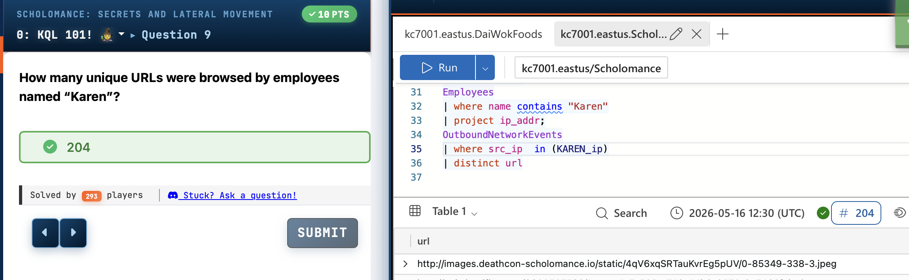
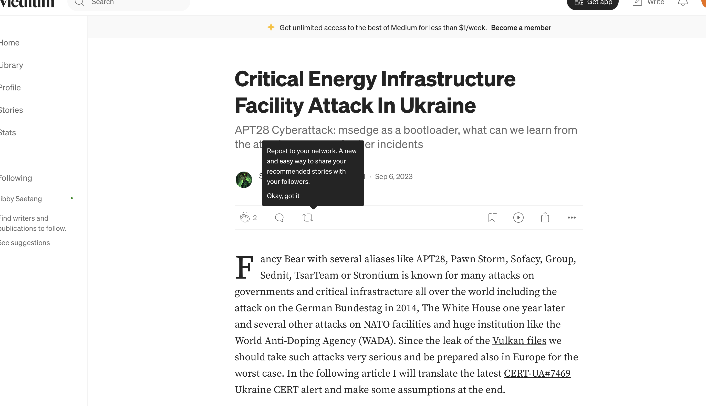
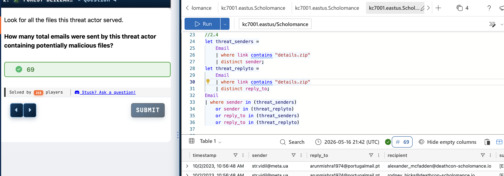
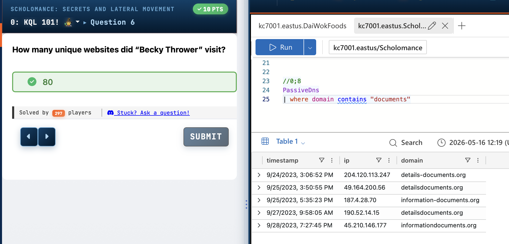
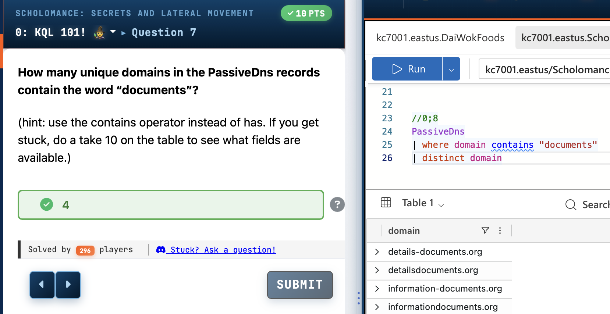

# Scholomance

A blue team CTF challenge involving KQL-based threat hunting and incident response to investigate a multi-stage APT28 (Forest Blizzard) cyberespionage campaign targeting critical research infrastructure.


*Query results showing employee 'Karen' browsed 204 unique URLs, with query logic filtering OutboundNetworkEvents by source IP and extracting distinct URLs.*



*KQL query enumerating 69 phishing emails containing malicious attachments (details.zip, photo.zip, or IOC_30_08.rar) sent by the threat actor, with sender and recipient details visible.*



*Email analysis query identifying five unique malicious domains serving the 'details.zip' file, including information-documents.org highlighted in the results.*



*PassiveDNS query results showing resolution data for domain 'information-documents.org' to IP 187.4.28.70 across multiple timestamps, establishing timeline of malicious infrastructure.*



*KQL query showing PassiveDNS records filtered for domains containing 'documents', revealing four suspicious domains including information-documents.org.*


  

---

## Challenge Overview

| **Attribute**       | **Details**                                                                 |
|---------------------|-----------------------------------------------------------------------------|
| **Challenge Name**  | Scholomance: Secrets and Lateral Movement                                   |
| **Author**          | David Brown                                                                 |
| **Platform**        | KC7 Cyber Range                                                             |
| **Category**        | Threat Hunting, Digital Forensics & Incident Response (DFIR), KQL Analysis  |
| **Difficulty**      | Medium                                                                      |
| **Tools Used**      | Kusto Query Language (KQL), Azure Data Explorer, KC7 Platform               |
| **Target/Box**      | Deathcon Scholomance Hidden Enclave (simulated research organization)       |

**Scenario:**

Investigate a sophisticated cyberespionage campaign attributed to APT28 (Forest Blizzard) targeting the Scholomance Hidden Enclave, a research organization handling sensitive magical research data. The threat actor conducted spear phishing, credential harvesting, lateral movement, and data exfiltration. Analysts must use KQL queries against authentication logs, email records, file creation events, network traffic, and passive DNS data to reconstruct the attack timeline, identify compromised systems, and extract indicators of compromise.

---

## Attack Timeline

| **Date/Time (UTC)**        | **Event**                                                                                  |
|----------------------------|--------------------------------------------------------------------------------------------|
| 2023-09-24 15:06:52        | PassiveDns records show registration of details-documents[.]org (204.120.113[.]247)        |
| 2023-09-25 17:50:55        | Domain detailsdocuments[.]org registered (49.164.200[.]56)                                 |
| 2023-09-25 19:35:23        | Domain information-documents[.]org registered (187.4.28[.]70)                              |
| 2023-09-27 09:58:05        | Additional detailsdocuments[.]org resolution (190.52.14[.]15)                              |
| 2023-09-28 19:27:45        | Domain informationdocuments[.]org registered (45.210.146[.]177)                            |
| 2023-10-02 10:56:48        | Spear phishing campaign begins; subject: "URGENT: Please provide locations..."             |
| 2023-10-02 11:07:34        | First details[.]zip file created on 2ZJA-LAPTOP (user: anjoseph)                            |
| 2023-10-12 14:35:33        | Internal reconnaissance: access to important_research.docx via enclave shares              |
| 2023-10-13 07:34:31        | GET request to hxxps://deathcon-scholomance[.]io/enclave_secrets/files/important_research.docx |
| 2023-10-24 10:12:08        | details[.]zip deployed to 3IOB-DESKTOP (user: kiwynn)                                        |
| 2023-10-26 03:29:18        | Malicious VBS script dc529177-39b4-4828-8c66-79fe35145d07.vbs created                      |
| 2023-10-27 05:27:10        | Credential harvester downloaded via curl to C:\ProgramData                                 |
| 2023-10-31 08:56:21        | Curl command executed on WWEI-LAPTOP (user: pawillis)                                      |
| 2023-11-01 10:59:00        | LSA protection disabled via registry modification on 7LCM-LAPTOP                           |
| 2023-11-02 02:10:46        | details[.]zip delivered to NXRU-MACHINE (user: perivera)                                     |
| 2023-11-02 08:37:57        | Credential harvester deployed on CWFU-LAPTOP (user: macraig)                               |
| 2023-11-03 09:58:22        | 7-Zip utility (7z2002-x64[.]exe) downloaded from hxxps://www.7-zip[.]org                     |
| 2023-11-03 10:07:30        | First research.7z archive created on TU06-DESKTOP (user: eihiggins)                        |
| 2023-11-03 10:24:43        | Last archived file created (final timestamp of data staging)                               |
| 2023-11-06 02:49:09        | Final details[.]zip file creation on 3WNA-MACHINE (user: pabartlett)                        |

---

## Solution Walkthrough

### Step 1 — Identify Spear Phishing Campaign

The investigation begins by identifying the initial access vector. Authentication logs revealed suspicious Firefox 69.0 user agents associated with successful logins.

```kql
// Result: Identified compromised user accounts
let comp_users =
AuthenticationEvents
| where user_agent == "Mozilla/5.0 (Macintosh; Intel Mac OS X 10.14; rv:69.0) Gecko/20100101 Firefox/69.0"
| where result contains "success"
| distinct username;
let comp_email =
Employees
| where username has_any(comp_users)
| distinct email_addr;
Email
| where sender has_any (comp_email)
| summarize count() by subject
| sort by count_
```

**Email subject:** URGENT: Please provide locations where your research is located.  
**Email count:** 90  
**Technique:** Spear phishing targeting higher privileged users

### Step 2 — Discover Accessed Sensitive Documents

Analysis of internal network events identified reconnaissance activity targeting secretive shares.

```kql
// Result: Found access to important_research.docx in enclave_secrets
InboundNetworkEvents
| where url has_any ("secretive", "shares", "enclave")
```

**Key findings:**
- **URL accessed:** hxxps://deathcon-scholomance[.]io/enclave_secrets/files/important_research.docx
- **Source IPs:** 155.214.175[.]217, 12.40.154[.]145, 179.87.68[.]254
- **Timestamp:** 2023-10-13 07:34:31Z

### Step 3 — Identify Malicious Tool Download

Threat actor downloaded 7-Zip archiving utility for data staging.

```kql
// Result: 14 instances of 7z2002-x64.exe download
OutboundNetworkEvents
| where url contains "7z2002-x64.exe"
```

**Download URL:** hxxps://www.7-zip[.]org/a/7z2002-x64[.]exe  
**Affected hosts:** WMSE-MACHINE, 0AA8-MACHINE, UBYT-LAPTOP, TU06-DESKTOP, UJUC-MACHINE, J9RM-DESKTOP, VV2G-MACHINE, STU5-LAPTOP, U8VN-MACHINE, VCSW-MACHINE, CTUD-LAPTOP, QIQV-MACHINE, QGYU-DESKTOP, 5RCL-DESKTOP

### Step 4 — Determine Data Exfiltration Staging

Identified archived files created by threat actor.

```kql
// Result: 28 .7z archive files created across 14 hosts
FileCreationEvents
| where hostname in ("WMSE-MACHINE", "0AA8-MACHINE", "UBYT-LAPTOP",
"TU06-DESKTOP", "UJUC-MACHINE", "J9RM-DESKTOP", "VV2G-MACHINE",
"STU5-LAPTOP", "U8VN-MACHINE", "VCSW-MACHINE", "CTUD-LAPTOP", "QIQV-MACHINE",
"QGYU-DESKTOP", "5RCL-DESKTOP")
| where filename endswith ".7z"
```

**Final archive timestamp:** 2023-11-03T10:24:43Z  
**Archive locations:** C:\Users\Public\Music\research.7z, C:\Users\Public\Documents\documents.7z

### Step 5 — Analyze Initial Malware Delivery

Investigated malicious ZIP files delivered via phishing emails.

```kql
// Result: 15 details.zip files quarantined
SecurityAlerts
| where timestamp >= datetime(2023-10-02)
| where description contains "quarantined"

FileCreationEvents
| where filename == "details.zip"
```

**Impacted roles:** 9 distinct job roles including Magical IT Nerd, Lead Research Enchanter, and Dark Magic Regulation Expert

### Step 6 — Correlate Email Infrastructure

Mapped malicious email senders to infrastructure.

```kql
// Result: 5 unique malicious domains identified
Email
| where link contains "details.zip"
| distinct link
```

**Malicious domains:**
- hxxp://detailsdocuments[.]com
- hxxps://modeldocuments[.]org
- hxxp://modelinformation[.]com
- hxxp://details-information[.]com
- hxxps://information-documents[.]org

### Step 7 — Enumerate Complete Phishing Campaign

Identified full scope of malicious email campaign.

```kql
// Result: 69 total phishing emails sent
let threat_senders =
    Email
    | where link contains "details.zip" or link contains "photo.zip" or link contains "IOC_30_08.rar"
    | distinct sender;
let threat_replyto =
    Email
    | where link contains "details.zip" or link contains "photo.zip" or link contains "IOC_30_08.rar"
    | distinct reply_to;
Email
| where sender in (threat_senders)
    or sender in (threat_replyto)
    or reply_to in (threat_senders)
    or reply_to in (threat_replyto)
```

**Malicious files:** details[.]zip, photo[.]zip, IOC_30_08.rar  
**Example sender:** strvidil[@]meta[.]ua  
**Example reply-to:** arunmishra1974[@]portugalmail[.]pt

### Step 8 — Identify File System Artifacts

Discovered malware staged to C:\ProgramData.

```kql
// Result: Malware persistence files in C:\ProgramData\
let infected_hosts =
    FileCreationEvents
    | where filename has_any ("details.zip", "photo.zip", "IOC_30_08.rar")
    | distinct hostname;
let new =
    FileCreationEvents
    | where hostname in (infected_hosts)
    | order by timestamp asc
    | serialize
    | extend newfile = next(filename)
    | where filename has_any ("details.zip", "photo.zip", "IOC_30_08.rar")
    | where newfile !in ("details.zip", "photo.zip", "IOC_30_08.rar")
    | distinct newfile;
FileCreationEvents
    | where filename has_any ("details.zip", "photo.zip", "IOC_30_08.rar") or filename in (new)
```

**Staging directory:** C:\ProgramData  
**Malicious files:** dc529177-39b4-4828-8c66-79fe35145d07.vbs, weblinks.cmd, l09y3h.css

### Step 9 — Attribution to APT28

Cross-referenced file artifacts with open-source intelligence.

```kql
// Result: Files match APT28/Forest Blizzard TTPs
FileCreationEvents
| where filename has_any ("details.zip", "photo.zip", "IOC_30_08.rar") or filename in (new)
| summarize count() by filename
| sort by count_ desc
```

**Attribution:** APT28 (also known as Fancy Bear, Sofacy, Pawn Storm, Sednit, TsarTeam, Strontium, Forest Blizzard)  
**Top malicious file:** dc529177-39b4-4828-8c66-79fe35145d07.vbs (60 instances)

### Step 10 — Identify Credential Harvesting Tool

Analyzed process command lines for credential theft.

```kql
// Result: Credential harvester downloaded via curl
ProcessEvents
| where process_commandline has_any ("curl")
| where filename != "C:\\Windows\\system32\\lsass.exe"
```

**Credential harvester:** dc529177-39b4-4828-8c66-79fe35145d07 (filename without extension)  
**Download method:** curl -k -o [filename]  
**Exfiltration endpoint:** hxxps://webhook[.]site/

### Step 11 — Detect Defense Evasion

Identified registry modifications to disable LSA protection.

```kql
// Result: LSA protection disabled on 7LCM-LAPTOP
ProcessEvents
| where hostname == "7LCM-LAPTOP"
| where process_commandline contains "RunAsPPL"
| project timestamp, parent_process_name, process_name, process_commandline
| sort by timestamp asc
```

**Registry key modified:** HKLM\SYSTEM\CurrentControlSet\Control\LSA  
**Value modified:** RunAsPPL set to 0  
**Timestamp:** 2023-11-01 10:59:00  
**Impact:** Disabled Local Security Authority Protection

### Step 12 — Enumerate PassiveDNS Infrastructure

Mapped threat actor infrastructure via passive DNS.

```kql
// Result: 4 unique malicious domains containing "documents"
PassiveDns
| where domain contains "documents"
| distinct domain
```

**Domains:**
- details-documents[.]org (204.120.113[.]247)
- detailsdocuments[.]org (multiple IPs)
- information-documents[.]org (187.4.28[.]70)
- informationdocuments[.]org (45.210.146[.]177)

---

## IOC Table

| **Type**       | **Indicator**                                                          | **Context**                                          | **Threat Actor**       |
|----------------|------------------------------------------------------------------------|------------------------------------------------------|------------------------|
| Domain         | detailsdocuments[.]com                                                 | Phishing infrastructure hosting details[.]zip          | APT28/Forest Blizzard  |
| Domain         | modeldocuments[.]org                                                   | Phishing infrastructure hosting details[.]zip          | APT28/Forest Blizzard  |
| Domain         | modelinformation[.]com                                                 | Phishing infrastructure hosting details[.]zip          | APT28/Forest Blizzard  |
| Domain         | details-information[.]com                                              | Phishing infrastructure hosting details[.]zip          | APT28/Forest Blizzard  |
| Domain         | information-documents[.]org                                            | Phishing infrastructure hosting details[.]zip          | APT28/Forest Blizzard  |
| Domain         | details-documents[.]org                                                | PassiveDNS malicious domain                          | APT28/Forest Blizzard  |
| Domain         | informationdocuments[.]org                                             | PassiveDNS malicious domain                          | APT28/Forest Blizzard  |
| Domain         | deathcon-scholomance[.]io                                              | Targeted organization domain                         | Victim                 |
| IPv4           | 204.120.113[.]247                                                      | Resolves to details-documents[.]org                  | APT28/Forest Blizzard  |
| IPv4           | 49.164.200[.]56                                                        | Resolves to detailsdocuments[.]org                   | APT28/Forest Blizzard  |
| IPv4           | 187.4.28[.]70                                                          | Resolves to information-documents[.]org              | APT28/Forest Blizzard  |
| IPv4           | 190.52.14[.]15                                                         | Resolves to detailsdocuments[.]org                   | APT28/Forest Blizzard  |
| IPv4           | 45.210.146[.]177                                                       | Resolves to informationdocuments[.]org               | APT28/Forest Blizzard  |
| IPv4           | 155.214.175[.]217                                                      | Internal reconnaissance source IP                    | APT28/Forest Blizzard  |
| IPv4           | 12.40.154[.]145                                                        | Internal reconnaissance source IP                    | APT28/Forest Blizzard  |
| IPv4           | 179.87.68[.]254                                                        | Internal reconnaissance source IP                    | APT28/Forest Blizzard  |
| Email          | strvidil[@]meta[.]ua                                                   | Phishing email sender                                | APT28/Forest Blizzard  |
| Email          | arunmishra1974[@]portugalmail[.]pt                                     | Phishing email reply-to                              | APT28/Forest Blizzard  |
| File Hash      | 7cff48626ec17cbbd41146879e03ace0c73bcefbc44d9bd9a1                     | details[.]zip (SHA256 partial)                         | APT28/Forest Blizzard  |
| File Hash      | d03373be2435af1966bfdfe51ae6d0038e4d4f3c353b63fea41144d144547121     | l09y3h.css (SHA256)                                  | APT28/Forest Blizzard  |
| File Hash      | af4d7ad40e505d047f9df078ef3f6c7e0207c882dc91705e2f4190cc7d2360ce     | aaccd6de-ce95-4fb2-b2c1-2d7ca08661a3[.]bat (SHA256)    | APT28/Forest Blizzard  |
| Filename       | details[.]zip                                                            | Malicious phishing attachment                        | APT28/Forest Blizzard  |
| Filename       | photo[.]zip                                                              | Malicious phishing attachment                        | APT28/Forest Blizzard  |
| Filename       | IOC_30_08.rar                                                          | Malicious phishing attachment                        | APT28/Forest Blizzard  |
| Filename       | dc529177-39b4-4828-8c66-79fe35145d07.vbs                               | Credential harvester script                          | APT28/Forest Blizzard  |
| Filename       | weblinks.cmd                                                           | Malicious batch script                               | APT28/Forest Blizzard  |
| Filename       | l09y3h.css                                                             | Obfuscated malicious file                            | APT28/Forest Blizzard  |
| Filename       | important_research.docx                                                | Targeted sensitive document                          | Victim                 |
| Filename       | research.7z                                                            | Data exfiltration archive                            | APT28/Forest Blizzard  |
| Filename       | documents.7z                                                           | Data exfiltration archive                            | APT28/Forest Blizzard  |
| Filename       | 7z2002-x64[.]exe                                                         | Legitimate 7-Zip tool used for staging               | Dual-use tool          |
| URL            | hxxps://webhook[.]site/                                                | Credential exfiltration endpoint                     | APT28/Forest Blizzard  |
| URL            | hxxps://www.7-zip[.]org/a/7z2002-x64[.]exe                               | Legitimate utility download                          | Legitimate             |
| File Path      | C:\ProgramData\                                                        | Malware staging directory                            | APT28/Forest Blizzard  |
| File Path      | C:\Users\Public\Music\research.7z                                      | Data archive location                                | APT28/Forest Blizzard  |
| File Path      | C:\Users\Public\Documents\documents.7z                                 | Data archive location                                | APT28/Forest Blizzard  |
| Registry Key   | HKLM\SYSTEM\CurrentControlSet\Control\LSA                              | LSA protection disabled                              | APT28/Forest Blizzard  |
| User Agent     | Mozilla/5.0 (Macintosh; Intel Mac OS X 10.14; rv:69.0) Gecko/20100101 Firefox/69.0 | Compromised account authentication                   | APT28/Forest Blizzard  |

---

## MITRE ATT&CK Mapping

| **Tactic**              | **Technique ID** | **Technique Name**                          | **Evidence from Investigation**                                                      |
|-------------------------|------------------|---------------------------------------------|--------------------------------------------------------------------------------------|
| Initial Access          | T1566.001        | Phishing: Spear Phishing Attachment         | 69 phishing emails sent with details[.]zip, photo[.]zip, IOC_30_08.rar attachments      |
| Initial Access          | T1566.002        | Phishing: Spear Phishing Link               | Emails contained links to malicious domains hosting ZIP files                        |
| Execution               | T1059.001        | Command and Scripting Interpreter: PowerShell | Set-MpPreference commands for AV evasion                                           |
| Execution               | T1059.003        | Command and Scripting Interpreter: Windows Command Shell | cmd[.]exe used for curl downloads and registry modifications                  |
| Execution               | T1059.005        | Command and Scripting Interpreter: Visual Basic | dc529177-39b4-4828-8c66-79fe35145d07.vbs credential harvester                     |
| Persistence             | T1547.001        | Boot or Logon Autostart: Registry Run Keys  | Malicious VBS scripts staged in user directories                                     |
| Defense Evasion         | T1112            | Modify Registry                             | RunAsPPL set to 0 to disable LSA protection                                          |
| Defense Evasion         | T1562.001        | Impair Defenses: Disable or Modify Tools    | DisableAntiSpyware, DisableRealtimeMonitoring references in process events           |
| Credential Access       | T1003.001        | OS Credential Dumping: LSASS Memory         | Credential harvester targeting lsass[.]exe                                             |
| Credential Access       | T1003.002        | OS Credential Dumping: Security Account Manager | reg[.]exe save hklm\software C:\Temp\software.save                                  |
| Discovery               | T1083            | File and Directory Discovery                | Access to enclave_secrets/files/important_research.docx                              |
| Discovery               | T1087            | Account Discovery                           | Employees table queried for targeted roles                                           |
| Collection              | T1560.001        | Archive Collected Data: Archive via Utility | 28 .7z archives created using 7-Zip (research.7z, documents.7z)                      |
| Command and Control     | T1071.001        | Application Layer Protocol: Web Protocols   | Curl commands to hxxps://webhook[.]site/ for credential exfiltration                 |
| Command and Control     | T1102            | Web Service                                 | Use of webhook[.]site for C2 communication                                           |
| Exfiltration            | T1041            | Exfiltration Over C2 Channel                | Data staged in .7z archives likely exfiltrated via webhook endpoint                  |
| Exfiltration            | T1567.002        | Exfiltration Over Web Service: Exfiltration to Cloud Storage | Webhook[.]site used for data exfiltration                              |

---

## Tools Used

- **Kusto Query Language (KQL)** — Primary query language for log analysis across authentication, email, file creation, and network event tables
- **KC7 Cyber Range Platform** — Cloud-based threat hunting training environment (kc7001.eastus.Scholomance)
- **PassiveDNS** — Historical DNS resolution data for infrastructure mapping
- **Azure Data Explorer** — Backend SIEM/data analytics platform for KQL queries
- **curl** — Used by threat actor for downloading credential harvester
- **7-Zip (7z2002-x64[.]exe)** — Legitimate archiving utility weaponized for data staging
- **reg[.]exe** — Windows Registry Editor used for defense evasion and credential dumping
- **cmd[.]exe** — Windows command processor used for malicious script execution

---

## Key Takeaways

1. **Multi-vector phishing campaigns require email link analysis** — Threat actors used 5 distinct domains and multiple file types (ZIP/RAR) to evade detection. Email link extraction and domain correlation using KQL's `distinct` and `has_any` operators enabled infrastructure mapping.

2. **Staged file analysis reveals post-exploitation activity** — By correlating FileCreationEvents on infected hosts, investigators discovered second-stage payloads (VBS scripts, CMD files) staged in C:\ProgramData, demonstrating the importance of temporal file system analysis.

3. **Registry modifications indicate defense evasion** — Disabling LSA protection (RunAsPPL=0) allowed credential dumping. Monitoring registry key changes via ProcessEvents provides critical detection opportunities for privilege escalation and defense evasion.

4. **Legitimate tools enable "living off the land" attacks** — 7-Zip and curl are benign utilities weaponized for data staging and exfiltration. Baseline legitimate tool usage and alert on anomalous parameters (e.g., curl with webhook[.]site destinations).

5. **Attribution through file artifact correlation** — The dc529177-39b4-4828-8c66-79fe35145d07.vbs file and TTPs matched APT28 campaigns documented in open-source intelligence, emphasizing the value of threat intelligence integration with SIEM data.

6. **KQL `let` statements enable complex threat hunting** — Using variables to store compromised users, threat sender lists, and infected hosts allows multi-stage queries that correlate events across disparate data sources (Employees, Email, FileCreationEvents, ProcessEvents).

---

## References

- [MITRE ATT&CK: APT28 Group Profile](https://attack.mitre.org/groups/G0007/)
- [MITRE ATT&CK: T1566.001 - Phishing: Spear Phishing Attachment](https://attack.mitre.org/techniques/T1566/001/)
- [MITRE ATT&CK: T1003.002 - OS Credential Dumping: Security Account Manager](https://attack.mitre.org/techniques/T1003/002/)
- [MITRE ATT&CK: T1560.001 - Archive Collected Data: Archive via Utility](https://attack.mitre.org/techniques/T1560/001/)
- [MITRE ATT&CK: T1112 - Modify Registry](https://attack.mitre.org/techniques/T1112/)
- [Microsoft: Forest Blizzard (APT28) Threat Intelligence](https://www.microsoft.com/en-us/security/blog/threat-intelligence/)
- [Kusto Query Language (KQL) Documentation](https://learn.microsoft.com/en-us/azure/data-explorer/kusto/query/)
- [KC7 Cyber Range Platform](hxxps://kc7cyber[.]com/)
- [CERT-UA Alert #7469 - APT28 Critical Energy Infrastructure Attack](hxxps://cert.gov.ua/)
- [7-Zip Official Download](hxxps://www.7-zip[.]org/)

---

*Author: David Brown | Platform: KC7 | Date: 2026-05-16*