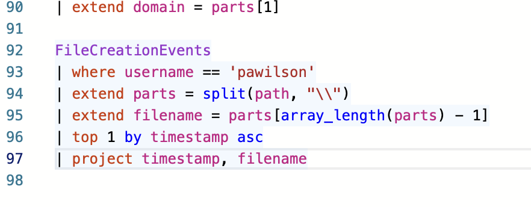
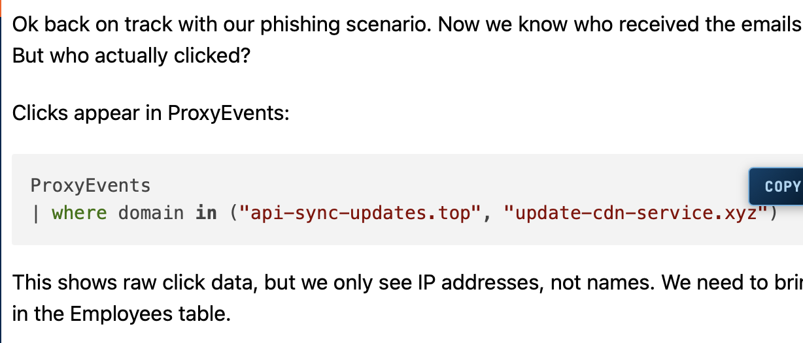
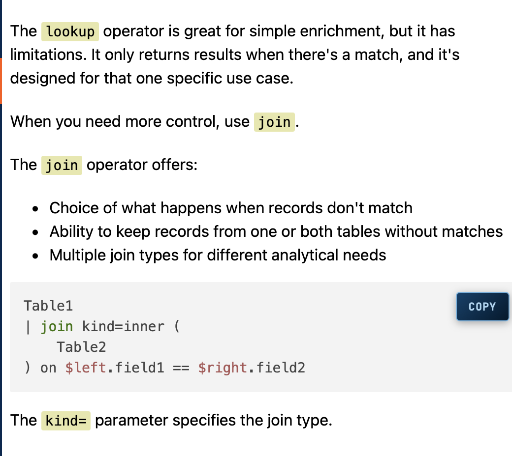
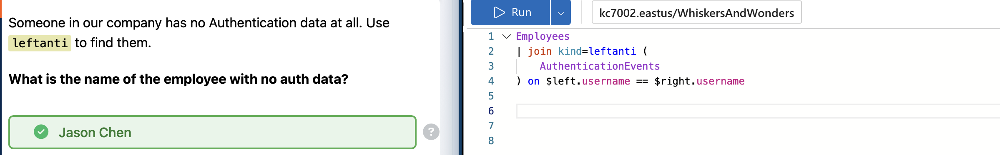
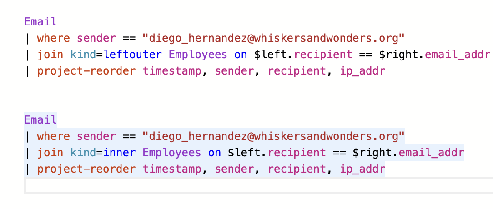

# KQL301: Detecting Phishing Campaign Victims Using Multi-Table Correlation

   


*ProxyEvents query filtering for malicious C2 domains api-sync-updates.top and update-cdn-service.xyz to identify command and control traffic.*



*KQL query using leftanti join to identify employee Jason Chen with no authentication events, indicating a potential backdoor or inactive account.*



*FileCreationEvents query filtering for user pawilson, extracting filename from path using split function to identify first file created by compromised user.*



*KQL query identifying phishing click activity by correlating Email data with ProxyEvents using mv-expand to extract links and matching on IP addresses and URLs.*



*KQL query correlating phishing emails from diego_hernandez@whiskersandwonders.org with employee click activity via Email and ProxyEvents tables using lookup joins.*


A comprehensive KQL detection rule that correlates phishing emails, employee records, and proxy events to identify compromised accounts and measure attack success metrics. This detection demonstrates advanced correlation techniques including multi-table joins, click rate calculation, and timeline analysis.

---

## Detection Summary

**Objective:** Identify employees who received and clicked on phishing emails, calculate compromise metrics, and establish attack timeline from initial phishing to final C2 beacon.

**Data Sources:**
- Email logs (`Email` table)
- Employee directory (`Employees` table)
- Proxy/web traffic logs (`ProxyEvents` table)

**Attack Scenario:**
A sophisticated phishing campaign targeted Whiskers and Wonders Animal Shelter employees with fake HR emails containing malicious links to attacker-controlled infrastructure designed to steal donor data.

**Key Indicators:**
- **Sender:** `noreply@whiskersandwonders-hr.com`
- **Malicious domains:** `api-sync-updates.top`, `update-cdn-service.xyz`
- **C2 infrastructure:** `185.174.137.42`
- **Attack vector:** Phishing emails with subject "Employee Benefits Update"
- **Compromised users:** Alex Rivera, David Okonkwo, Jessica Huang

---

## KQL Query

```kql
// Define phishing sender and malicious domains
let phishing_sender = "noreply@whiskersandwonders-hr.com";
let malicious_domains = dynamic(["api-sync-updates.top", "update-cdn-service.xyz"]);

// Build complete attack timeline
let timeline = union (
    Email
    | where sender == phishing_sender
    | project timestamp, activity = "phishing_email", recipient, links
), (
    ProxyEvents
    | where url has_any (malicious_domains)
    | project timestamp, activity = "c2_beacon", src_ip, url
);

// Identify employees who clicked malicious links
Email
| where sender == phishing_sender
| mv-expand links to typeof(string)
| join kind=inner Employees on $left.recipient == $right.email_addr
| join kind=leftouter (
    ProxyEvents
    | where url has_any (malicious_domains)
) on $left.ip_addr == $right.src_ip, $left.links == $right.url
| extend clicked = iff(isnotempty(timestamp1), 1, 0)
| project 
    email_sent_at = timestamp,
    sender,
    recipient,
    employee_name = name,
    role,
    ip_addr,
    malicious_link = links,
    link_clicked_at = timestamp1,
    clicked_url = url,
    clicked
| summarize 
    total_emails = count(),
    clicks = sum(clicked),
    click_rate = round((sum(clicked) / todouble(count())) * 100, 0),
    compromised_accounts = dcount(recipient),
    compromised_users = make_set_if(recipient, clicked == 1),
    first_click = min(link_clicked_at),
    last_click = max(link_clicked_at)
| extend 
    attack_duration_minutes = datetime_diff('minute', last_click, 
        toscalar(timeline | where activity == "phishing_email" | summarize min(timestamp)))
```

---

## How It Works

### 1. **Variable Definition**
The query begins by defining key indicators using `let` statements for reusability and clarity:
- `phishing_sender`: Known malicious email address
- `malicious_domains`: Dynamic array of attacker-controlled infrastructure

### 2. **Timeline Construction**
Uses `union` to combine phishing emails and C2 beacon events into a unified timeline for temporal analysis.

### 3. **Multi-Table Correlation**
The detection performs three critical joins:

**First Join (Inner):**
```kql
| join kind=inner Employees on $left.recipient == $right.email_addr
```
- Enriches email recipients with employee context (name, role, IP address)
- Filters to only known employees (insiders)

**Second Join (Left Outer):**
```kql
| join kind=leftouter (ProxyEvents...) on $left.ip_addr == $right.src_ip, $left.links == $right.url
```
- Correlates email links with actual click-through behavior in proxy logs
- Uses `leftouter` to retain all email recipients (clicked or not)
- Matches on both IP address AND URL for precision

### 4. **Click Detection Logic**
```kql
| extend clicked = iff(isnotempty(timestamp1), 1, 0)
```
- Creates binary indicator: 1 if proxy timestamp exists (clicked), 0 if null (not clicked)

### 5. **Aggregation and Metrics**
The query calculates key security metrics:
- **Total emails sent** in campaign
- **Click count** and **click rate percentage**
- **Distinct compromised accounts** (dcount)
- **List of compromised users** (make_set_if)
- **Attack duration** from first phishing email to last observed C2 beacon

### 6. **Alternative Detection Variants**

**Identify Non-Clickers (Leftanti):**
```kql
Email
| where sender == phishing_sender
| mv-expand links to typeof(string)
| join kind=leftanti Employees on $left.recipient == $right.email_addr
| join kind=leftanti (
    ProxyEvents | where url has_any (malicious_domains)
) on $left.ip_addr == $right.src_ip, $left.links == $right.url
| summarize emails_not_clicked = count()
```
- Uses `leftanti` joins to find emails where recipients did NOT click
- Useful for measuring security awareness effectiveness

---

## False Positive Tuning

### Common False Positives

1. **Legitimate HR Communications**
   - **Issue:** Real HR may use similar sender patterns
   - **Mitigation:** Validate against known legitimate HR email infrastructure; add exceptions for verified HR domains
   
2. **CDN Service False Matches**
   - **Issue:** Legitimate CDN services may match domain patterns
   - **Mitigation:** Whitelist known-good CDN providers; use reputation scoring

3. **Shared IP Addresses**
   - **Issue:** DHCP or VPN may cause IP overlap
   - **Mitigation:** Add time-based correlation windows; require temporal proximity between email receipt and click (e.g., within 24 hours)

4. **Archived/Historical Data**
   - **Issue:** Old phishing campaigns may trigger alerts
   - **Mitigation:** Add time filters to focus on recent activity:
     ```kql
     | where timestamp > ago(7d)
     ```

### Tuning Recommendations

**Reduce Noise:**
- Implement domain reputation checks using threat intelligence feeds
- Add `isnotempty()` checks for critical fields to ensure data quality
- Filter out test/service accounts with known patterns

**Increase Accuracy:**
- Require multiple indicators (email + click + subsequent C2 traffic)
- Use `datetime_diff()` to enforce realistic click timing (e.g., within 1 hour of email receipt)
- Correlate with additional tables (FileCreationEvents, AuthenticationEvents) for high-confidence compromises

**Example Tuned Query:**
```kql
// Add time proximity check
| where datetime_diff('minute', link_clicked_at, email_sent_at) between (0 .. 1440) // Within 24 hours
// Require post-click C2 activity
| join kind=inner (
    ProxyEvents
    | where url has_any (malicious_domains)
    | where timestamp > email_sent_at
) on $left.ip_addr == $right.src_ip
```

---

## MITRE Mapping Table

| MITRE Technique | Tactic | Detection Coverage | Notes |
|-----------------|--------|-------------------|-------|
| **T1566.002** - Phishing: Spearphishing Link | Initial Access | Direct | Detects phishing emails with malicious links; identifies sender and recipients |
| **T1204.001** - User Execution: Malicious Link | Execution | Direct | Correlates email delivery with user click-through behavior via proxy logs |
| **T1071.001** - Application Layer Protocol: Web Protocols | Command and Control | Direct | Identifies ongoing C2 beaconing to attacker infrastructure over HTTP/HTTPS |
| **T1132** - Data Encoding | Command and Control | Indirect | C2 domains mimic legitimate CDN services; encoding/obfuscation likely |
| **T1566.001** - Phishing: Spearphishing Attachment | Initial Access | Partial | Query can be extended to detect malicious attachments via FileCreationEvents correlation |
| **T1078** - Valid Accounts | Defense Evasion | Indirect | Compromised accounts may exhibit anomalous authentication patterns post-click |
| **T1048** - Exfiltration Over Alternative Protocol | Exfiltration | Partial | C2 channels may be used for donor data exfiltration; requires payload analysis |

---

## Key Takeaways

1. **Multi-Table Correlation is Essential** - Phishing detection requires joining Email, Employees, and ProxyEvents tables to connect sender, recipient, and click behavior with user identities.

2. **Join Type Selection Matters** - Use `inner` joins to find confirmed compromises, `leftouter` to measure click rates including non-clickers, and `leftanti` to identify security-aware users who didn't click.

3. **Click Rate as a Metric** - The 64% click rate demonstrates campaign effectiveness and highlights need for security awareness training.

4. **Timeline Analysis Reveals Persistence** - Calculating attack duration (7,505 minutes ≈ 5.2 days) from first email to last C2 beacon shows attacker maintained access for extended period.

5. **mv-expand for Link Analysis** - The `mv-expand` operator is critical for analyzing emails containing multiple malicious URLs, enabling per-link correlation.

6. **Temporal Correlation Reduces False Positives** - Adding time-based constraints between email receipt and click events improves detection accuracy.

7. **Aggregate Functions Provide Executive Metrics** - Using `dcount()`, `make_set_if()`, and percentage calculations transforms raw detections into actionable intelligence for leadership.

8. **Domain Reputation is Key** - Attackers use typosquatting (api-sync-updates[.]top mimicking legitimate services) requiring reputation-based filtering to distinguish malicious from legitimate infrastructure.